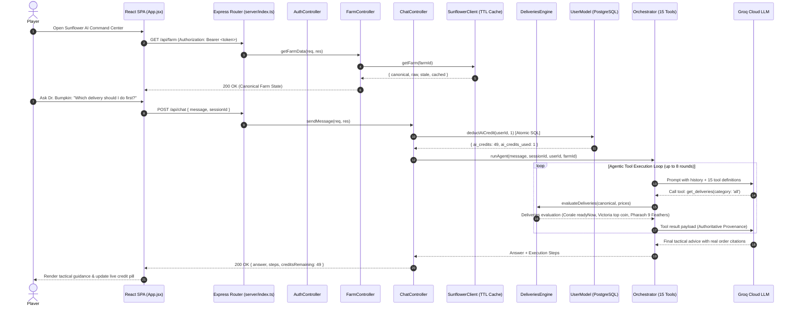

# 00. System Overview 🌻

## 1. Introduction

**Sunflower AI** is an advanced operational command center, economic modeling engine, and autonomous decision-support platform designed for players of **Sunflower Land (SFL)**—a Web3 farming, gathering, crafting, and trading simulation on the Polygon blockchain.

The primary objective of Sunflower AI is to solve the multi-variable mathematical, temporal, and capital allocation challenge of progressing an on-chain **Bumpkin to Level 100 Mastery** while maximizing resource efficiency (FLOWER currency, crops, animal products, and cooking building uptime).

```
┌──────────────────────────────────────────────────────────────────────────────────┐
│                                   SUNFLOWER AI                                   │
│                    Bumpkin Level 100 Autonomous Command Center                   │
└────────────────────────────────────────┬─────────────────────────────────────────┘
                                         │
        ┌────────────────────────────────┼────────────────────────────────┐
        ▼                                ▼                                ▼
┌──────────────────────┐      ┌──────────────────────┐      ┌──────────────────────────┐
│   Cooking Planner    │      │  Market & Inventory  │      │   Dr. Bumpkin Copilot    │
│  XP/FLOWER & XP/Hour │      │ Real-time P2P orders │      │ Multi-turn Tool Loop (15)│
│  Building pipelines  │      │ Valuation & Deficits │      │ RAG + Live Farm State    │
└──────────────────────┘      └──────────────────────┘      └──────────────────────────┘
        │                                │                                │
        ▼                                ▼                                ▼
┌──────────────────────┐      ┌──────────────────────┐      ┌──────────────────────────┐
│ Codex Deliveries &   │      │ Security & Sessions  │      │    Credit Quota Engine   │
│ Chores & Mega Bounty │      │ 1-Account/IP + Dual  │      │ Atomic Reservation &     │
│ VIP Shiny Feathers   │      │ Desktop/Mobile Limit │      │ Live UI Credit Balance   │
└──────────────────────┘      └──────────────────────┘      └──────────────────────────┘
```

---

## 2. Core Value Pillars

### 2.1 Optimal Cooking & XP Progression Engine
Cooking food is the primary mechanism for gaining Bumpkin XP in Sunflower Land. Recipes require diverse ingredients (crops, fruits, milk, eggs, honey, fish) produced across multiple specialized buildings:
- **Fire Pit** (basic foods: Mashed Potato, Boiled Chestnuts, Roast Veggies)
- **Kitchen** (intermediate dishes: Chowder, Pancakes, Fruit Salad)
- **Bakery** (advanced pastries and cakes: Apple Pie, Orange Cake, Honey Cake)
- **Deli** (sandwiches and luxury dishes: Fermented Carrots, Sauerkraut, Pizza Margherita)
- **Smoothie Shack** (fruit smoothies: Banana Smoothie, Power Smoothie)

Sunflower AI dynamically models:
- **Base XP vs. Effective XP**: Multiplicative factoring of active skill tree masteries (e.g., *Munching Mastery*, *Drive-Through Deli*, *Juicy Boost*, *Fishy Feast*, *Buzzworthy Treats*) and active VIP Membership (+10% multiplicative boost).
- **Cook Time Reductions**: Applies building-level oil burners and skill masteries (*Fast Feasts*, *Frosted Cakes*, *Swift Sizzle*, *Turbo Fry*, *Fry Frenzy*).
- **Batch Output & Yield**: Considers *Double Nom* (2× output and 2× ingredient requirement).
- **XP per FLOWER Cost**: Identifies the cheapest routes to Level 100 in terms of liquid token expenditure.
- **XP per Production Hour**: Identifies the fastest routes to Level 100 in terms of real-world cooking time.
- **Total Milestone Forecast**: Pre-calculates exact batches and total FLOWER needed to reach Level 100 from current XP.

### 2.2 Inventory & Real-Time Market Valuation
- Synchronizes with community P2P orderbooks to establish live market prices for all tradable crops, animal goods, and consumables.
- Computes total farm liquid inventory value in FLOWER.
- Automatically calculates ingredient deficits: whether items should be purchased from the marketplace (`buy`) or must be produced directly on the farm (`mustProduce` for untradable or unpriced items).

### 2.3 Activity & Snapshot Delta Engine
- Persists canonical farm state snapshots in PostgreSQL with SHA-1 deduplication.
- Calculates exact observation windows and computes:
  - **Observed activity counters** (crops planted/harvested, trees chopped, iron mined).
  - **Inferred activity** (XP deltas, net currency changes, items consumed/sold) with confidence ratings and gap detection.

### 2.4 Codex Deliveries, Weekly Chores & Poppy Mega Bounty Board
- **Deliveries Engine (`evaluateDeliveries`)**: Evaluates NPC delivery orders across Coins, SFL, and seasonal Shiny Feathers.
  - Computes ingredient readiness (`readyNow`), market ingredient FLOWER costs, net SFL profit, and return on investment.
  - Dynamically calculates Shiny Feathers for seasonal deliveries based on NPC tier:
    - **Elite NPCs** (Pharaoh, Tywin): 6 base Shiny Feathers.
    - **Medium NPCs** (Cornwell, Bert, Raven, Jester): 3 base Shiny Feathers.
    - **Standard NPCs** (Finley, Miranda, etc.): 2 base Shiny Feathers.
  - Active VIP Membership boost: deterministically adds `+3 Shiny Feathers` to all seasonal orders (Pharaoh: 9 Feathers / +45 Ascension points; Cornwell: 6 Feathers / +30 pts; Finley/Miranda: 5 Feathers / +25 pts).
  - Highlights top recommendations: `bestCoinsDelivery` (e.g. Victoria: 1,100 Coins), `bestReadyNowDelivery` (e.g. Corale: 2 Mahi Mahi -> 578 Coins instantly with zero extra investment), `bestSflDelivery` (e.g. Grimtooth: 0.4 SFL), and `bestFeathersDelivery` (e.g. Pharaoh: 9 Feathers).
- **Weekly Chores & Bounties (`evaluateCodexTasks`)**:
  - **Weekly Chores (Tab 21)**: Maps chore requirements against live `farmActivity` counters (`currentProgress = farmActivity[activityName] - initialProgress`), e.g. Pumpkin' Pete at 199/200 pumpkins with 4 Shiny Feathers under VIP.
  - **Poppy Mega Bounty Board (Tab 33)**: Evaluates bounties across 6 categories (Flowers, Fish, Crustaceans, Animals, Artefacts, Giant Crops) and computes claim readiness.

### 2.5 Security, Sybil Protection & Concurrent Session Governance
- **1-Account-Per-IP Registration Gate**: Intercepts registration requests via `ipGate.ts` and `AuthService.ts`, recording `users.registration_ip` and restricting public users to 1 account per IP address to curb Sybil farm spam (developer accounts cleanly exempted).
- **Dual-Device Concurrent Session Management**: Tracks sessions via `active_sessions` with SHA-256 hashed refresh tokens. Enforces a strict limit of **1 Desktop + 1 Mobile** session per user. Concurrent logins on the same device type yield a `409 SESSION_CONFLICT` or permit `forceDisconnect: true` to invalidate previous refresh tokens.

### 2.6 Atomic AI Credit Quota & Usage Ledger
- **Atomic Credit Reservation**: Protects against race conditions by reserving credits via atomic PostgreSQL SQL (`UPDATE users SET ai_credits = ai_credits - $2 WHERE id = $1 AND ai_credits >= $2 RETURNING ai_credits, ai_credits_used`).
- **Automated Failure Refund**: If the AI model inference fails or throws an exception, reserved credits are immediately credited back to the user account.
- **Developer Bypass & Real-Time UI Counter**: Developers have 999,999 credits and bypass deduction. The client UI displays real-time remaining credits in the workspace header and chat modal.

### 2.7 Autonomous AI Copilot ("Dr. Bumpkin")
- Conversational farm strategist powered by **Groq Cloud LLMs** (`llama-3.3-70b-versatile`).
- Operates on a **PLAN → ACT → CHECK → FIX** agentic loop with **15 specialized deterministic tools**:
  1. `get_farm_state`: Complete normalized inventory, level, XP, currencies, buildings, skills from durable snapshots or hot cache.
  2. `get_roadmap`: Hierarchical multi-phase tactical roadmap with daily objectives and resource commitments.
  3. `check_action_permission`: Authoritative discretionary balance and hard reserve constraint validator.
  4. `evaluate_strategy_feasibility`: Evaluates proposed recipe or crafting batches against budgets and deadlines.
  5. `get_temporal_context`: In-game Sunflower clock, day boundary, and seasonal urgency index.
  6. `get_history_metrics`: Aggregated historical deltas with strict observed vs inferred separation.
  7. `compute_recipe_cost`: Effective recipe economics with building ownership verification gates.
  8. `get_active_effects`: Authoritative resolution of placed collectibles, equipped wearables, and timed buffs.
  9. `get_market_prices`: Live P2P community market orderbook prices in FLOWER.
  10. `recall_memory`: Semantic vector search across past archived conversational sessions (`pgvector`).
  11. `get_item_metadata`: Static game metadata lookup with collision disambiguation.
  12. `get_expansion_details`: Multi-island progression requirements (Desert, Volcano, etc.).
  13. `evaluate_buy_vs_farm`: Feed vs market ROI breakdown for animal produce (Milk, Eggs, Wool).
  14. `get_deliveries`: Evaluates NPC delivery orders sorted by profit, Coins, SFL, and `readyNow` status.
  15. `get_codex_chores_and_bounties`: Evaluates Weekly Chores and Poppy Mega Bounties with live progress.
- **Anti-Hallucination Real-Examples Disambiguation (Rule 9)**: When player intent is ambiguous, Dr. Bumpkin is strictly forbidden from using fake system placeholders (e.g. `"Delivery 1 - Milk & Eggs"`). It MUST always cite real, active orders and chores directly from the player's Codex board with NPC names, exact ingredients, and actual rewards.

---

## 3. Technology Stack

| Domain | Technology | Implementation Detail |
|---|---|---|
| **Backend Runtime** | Node.js (v20+) ESM with `tsx` | TypeScript execution with zero separate compile step for rapid development |
| **Language** | TypeScript 5.9 | Full strict type checking across all controllers, models, and modular services |
| **Backend Framework** | Express 4.21 | Modular router with class-based controllers and middleware |
| **Relational Database** | PostgreSQL 16 | ACID transaction storage for users, snapshots, sessions, and credits |
| **Vector Database** | `pgvector` Extension | 384-dimensional vector cosine similarity retrieval (`<=>`) |
| **Hot State Cache** | Redis 7 Alpine / In-Memory | Fast monotonic farm state projection with seamless hermetic fallback |
| **Local AI Embeddings** | `@xenova/transformers` (`all-MiniLM-L6-v2`) | Pure JavaScript vector generation without external SaaS costs |
| **LLM Inference** | Groq Cloud API (`llama-3.3-70b-versatile`) | Ultra-low latency chat completions with tool-calling execution |
| **Containerization** | Docker & Docker Compose | Multi-stage build packaging React SPA and Node.js TS backend |
| **Frontend Framework** | React 19 & Vite 6 | High-performance single page application (SPA) |
| **Styling & Design System** | TailwindCSS + Obsidian/Notion Tokens | Hybrid dual-pane document workspace and responsive mobile dock |
| **Web3 Data Ingestion** | SFL Community API & Polygon RPC | Live on-chain farm state retrieval with memory + atomic disk TTL cache |

---

## 4. Key Directories & Workspace Layout

```
sunflower-ai/
├── client/                           # React 19 + Vite Frontend SPA
│   ├── public/                       # Pixel-art sprites & WebP chibis
│   ├── src/
│   │   ├── App.jsx                   # Main workspace shell (Ribbon, Sidebar, Canvas, Copilot)
│   │   ├── Auth.jsx                  # Authentication modal & registration
│   │   ├── authContext.jsx           # Global JWT & user state provider (credit balance)
│   │   ├── api.js                    # Fetch client with automatic Bearer token injection
│   │   └── index.css                 # Design system tokens and custom scroll utilities
│   ├── package.json
│   └── vite.config.js
├── server/                           # Class-Based TypeScript Backend
│   ├── controllers/                  # Class-based HTTP controllers
│   │   ├── AuthController.ts         # User auth, registration, IP gating, session cap
│   │   ├── FarmController.ts         # Farm state, market prices, planner, quests
│   │   └── ChatController.ts         # Agent conversation, credit reservation, memory
│   ├── core/                         # Pure deterministic calculation engines
│   │   ├── economyEngine/            # Cost, expansion, ROI, and deliveries
│   │   │   └── deliveries.ts         # Pure deterministic Codex deliveries & chores engine
│   │   ├── productionEngine/         # Animal feeds, crop progression, processing
│   │   └── effectEngine/             # Collectible boosts, wearables, timed buffs
│   ├── services/                     # Modular business services
│   │   ├── ai/                       # AI Agent & Reasoning
│   │   │   ├── Orchestrator.ts       # PLAN-ACT-CHECK-FIX 15-tool agent loop
│   │   │   └── GroqClient.ts         # Groq LLM API wrapper
│   │   ├── cooking/                  # Cooking, Economics & XP
│   │   │   ├── PlannerService.ts     # Building optimizer & milestone calculator
│   │   │   ├── RecipeService.ts      # Ingredient tree expander & market cost
│   │   │   └── XpEngine.ts           # Skill masteries, VIP & cook time logic
│   │   ├── farm/                     # Farm State & Blockchain Ingestion
│   │   │   ├── SunflowerClient.ts    # Community API client (TTL + disk cache)
│   │   │   ├── FarmNormalizer.ts     # Raw SFL JSON -> CanonicalFarmState
│   │   │   ├── SnapshotService.ts    # PostgreSQL snapshot persistence & hash
│   │   │   └── ActivityService.ts    # Observed & inferred activity diffs
│   │   ├── auth/                     # Authentication & session governance
│   │   │   └── AuthService.ts        # Password hashing, JWT creation/validation, IP gate
│   │   └── chat/                     # Conversational memory
│   │       └── ChatStoreService.ts   # Local ONNX vector embedding & pgvector
│   ├── models/                       # Database models
│   │   ├── User.ts                   # User entity & SQL queries
│   │   ├── UserModel.ts              # Credit deduction, refund, and registration IP
│   │   ├── SessionModel.ts           # Active sessions table & concurrent device caps
│   │   ├── Snapshot.ts               # Snapshot record model
│   │   └── ChatMessage.ts            # Chat message & vector search model
│   ├── types/                        # Core TypeScript interfaces
│   │   └── index.ts                  # CanonicalFarmState, CookingPlan, AIToolResult, etc.
│   ├── middleware/                   # Express middlewares
│   │   ├── auth.ts                   # JWT verification & farm ID guard
│   │   └── ipGate.ts                 # 1-Account-Per-IP registration gate
│   ├── db/                           # Database connection & schema
│   │   ├── database.js               # pg.Pool connection, auto-migrations & retry logic
│   │   └── schema.sql                # DDL with pgvector extension
│   ├── data/                         # Static game configuration
│   │   ├── recipes.json              # Full cooking recipe definitions
│   │   ├── items.json                # Item metadata & tradability flags
│   │   ├── skills.json               # Skill tree catalogue & tiers
│   │   ├── modifiers.json            # Collectible & custom boost overrides
│   │   ├── levels.json               # Bumpkin XP level requirements table
│   │   └── expansion.json            # Land plot, island requirements & costs
│   └── index.ts                      # Server bootstrap & route mounting
├── Dockerfile                        # Multi-stage production container build
├── docker-compose.yml                # Node.js + PostgreSQL 16 + Redis 7 stack
├── docs/                             # In-depth technical documentation
├── package.json                      # Root configuration with tsx scripts
└── tsconfig.json                     # TypeScript strict configuration
```

---

## 5. How the System Works — High-Level Workflow



### Core Execution Flow:
1. **Client Bootstrap**: The player logs into the frontend SPA. React loads core datasets in parallel using `Promise.all([api.farm(), api.planner(), api.market(), api.recipes()])`.
2. **Ingestion & Caching**: Requests hit `FarmController.ts`. The controller queries `SunflowerClient.ts`, which checks its 5-minute memory cache, Redis hot cache, and atomic disk cache before calling the external SFL Community API. In-flight duplicate requests for the same farm are merged into a single Promise.
3. **Normalization**: Raw SFL blockchain JSON is parsed by `FarmNormalizer.ts` into a strictly typed `CanonicalFarmState`, resolving bumpkin levels, liquid currency balances, item inventory counts, building busy timers, skills, and quest deliveries.
4. **Deterministic Calculation Engines**: Specialized engines under `server/core/` (`economyEngine/deliveries.ts`, `productionEngine/`, `effectEngine/`) calculate exact recipe economics, animal feed vs market trade-offs, and Codex delivery rewards with VIP Shiny Feather bonuses.
5. **Atomic Credit & Agentic Copilot**: When the player chats with Dr. Bumpkin, `ChatController.ts` atomically reserves 1 credit via `UserModel.ts`. Then `Orchestrator.ts` executes an iterative loop calling up to 15 deterministic tools via Groq LLM, enforcing real-example citations and delivering grounded advice without hallucination.
