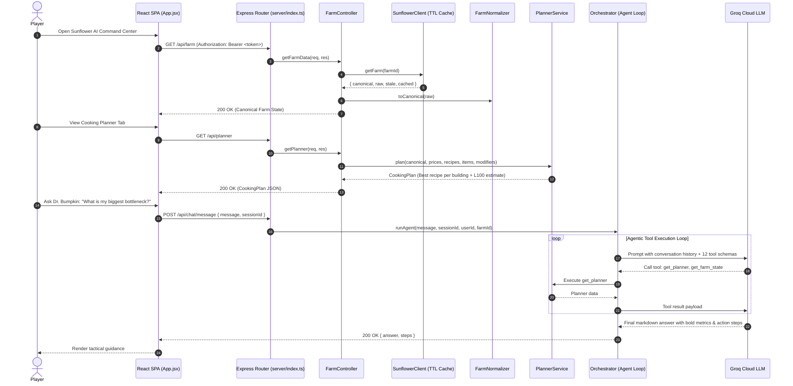

# 00. System Overview 🌻

## 1. Introduction

**Sunflower AI** is an advanced operational command center, economic modeling engine, and autonomous decision-support platform designed for players of **Sunflower Land (SFL)**—a Web3 farming, gathering, crafting, and trading simulation on the Polygon blockchain.

The primary objective of Sunflower AI is to solve the multi-variable mathematical, temporal, and capital allocation challenge of progressing an on-chain **Bumpkin to Level 100 Mastery** while maximizing resource efficiency (FLOWER currency, crops, animal products, and cooking building uptime).

```
┌────────────────────────────────────────────────────────────────────────────┐
│                              SUNFLOWER AI                                  │
│                 Bumpkin Level 100 Autonomous Command Center                │
└─────────────────────────────────────┬──────────────────────────────────────┘
                                      │
           ┌──────────────────────────┼──────────────────────────┐
           ▼                          ▼                          ▼
┌──────────────────────┐   ┌──────────────────────┐   ┌──────────────────────┐
│   Cooking Planner    │   │  Market & Inventory  │   │  Dr. Bumpkin Copilot │
│  XP/FLOWER & XP/Hour │   │ Real-time P2P orders │   │ Multi-turn Tool Loop │
│  Building pipelines  │   │ Valuation & Deficits │   │ RAG + Live Farm State│
└──────────────────────┘   └──────────────────────┘   └──────────────────────┘
```

---

## 2. Core Value Pillars

### 2.1 Optimal Cooking & XP Progression Engine
Cooking food is the primary mechanism for gaining Bumpkin XP in Sunflower Land. Recipes require diverse ingredients (crops, fruits, milk, eggs, honey, fish) produced across multiple specialized buildings:
- **Fire Pit** (basic foods: Mashed Potato, Boiled Chestnuts, Roast Veggies)
- **Kitchen** (intermediate dishes: Chowder, Pancakes, Fruit Salad)
- **Bakery** (advanced pastries and cakes: Apple Pie, Orange Cake, Honey Cake)
- **Deli** (sandwiches and luxury dishes: Fermented Carrots, Sauerkraut, Pizza Margherita)
- **Smoothie Shack** (fruit smoothies: Banana Smoothie, Power Smoothie)

Sunflower AI dynamically models:
- **Base XP vs. Effective XP**: Multiplicative factoring of active skill tree masteries (e.g., *Munching Mastery*, *Drive-Through Deli*, *Juicy Boost*, *Fishy Feast*, *Buzzworthy Treats*) and active VIP Membership (+10% multiplicative boost).
- **Cook Time Reductions**: Applies building-level oil burners and skill masteries (*Fast Feasts*, *Frosted Cakes*, *Swift Sizzle*, *Turbo Fry*, *Fry Frenzy*).
- **Batch Output & Yield**: Considers *Double Nom* (2× output and 2× ingredient requirement).
- **XP per FLOWER Cost**: Identifies the cheapest routes to Level 100 in terms of liquid token expenditure.
- **XP per Production Hour**: Identifies the fastest routes to Level 100 in terms of real-world cooking time.
- **Total Milestone Forecast**: Pre-calculates exact batches and total FLOWER needed to reach Level 100 from current XP.

### 2.2 Inventory & Real-Time Market Valuation
- Synchronizes with community P2P orderbooks to establish live market prices for all tradable crops, animal goods, and consumables.
- Computes total farm liquid inventory value in FLOWER.
- Automatically calculates ingredient deficits: whether items should be purchased from the marketplace (`buy`) or must be produced directly on the farm (`mustProduce` for untradable or unpriced items).

### 2.3 Activity & Snapshot Delta Engine
- Persists canonical farm state snapshots in PostgreSQL with SHA-1 deduplication.
- Calculates exact observation windows and computes:
  - **Observed activity counters** (crops planted/harvested, trees chopped, iron mined).
  - **Inferred activity** (XP deltas, net currency changes, items consumed/sold).

### 2.4 Autonomous AI Copilot ("Dr. Bumpkin")
- Conversational farm strategist powered by **Groq Cloud LLMs** (`llama-3.3-70b-versatile`).
- Operates on a **PLAN → ACT → CHECK → FIX** agentic loop with 12 specialized tools:
  - `get_farm_state`: Complete normalized inventory, level, XP, currencies, buildings, skills.
  - `get_farm_section`: Dot-path extraction into any raw farm JSON structure (greenhouse, calendar, npcs, etc.).
  - `get_market_prices`: Live P2P market prices in FLOWER.
  - `compute_recipe_cost`: Effective recipe economics with building ownership gate warnings.
  - `get_cooking_board`: Active recipes partitioned into `canCook` and `missingIngredients`.
  - `get_planner`: Per-building optimization pipeline and Level 100 milestone estimates.
  - `take_snapshot` & `get_activity_delta`: State snapshots and historical activity diffs.
  - `get_quests`: Active chore board, delivery orders, and bounties.
  - `get_skill_info`: Full catalogue definitions and active tier checks.
  - `recall_memory`: Semantic vector search across past archived sessions (`pgvector`).
  - `get_expansion_guide`: Multi-island progression roadmap (Desert → Volcano journey calculations).

### 2.5 Multi-Tenant Architecture & Data Isolation
- Robust user authentication system powered by bcrypt password hashing and JWT authorization.
- Strict isolation of Farm IDs, historical snapshots, and assistant conversation sessions by `user_id`.

---

## 3. Technology Stack

| Domain | Technology | Implementation Detail |
|---|---|---|
| **Backend Runtime** | Node.js (v18+) ESM with `tsx` | TypeScript execution without a separate build step for fast dev and execution |
| **Language** | TypeScript 5.9 | Full strict type checking across all controllers, models, and modular services |
| **Backend Framework** | Express 4.21 | Modular router with class-based controllers and middleware |
| **Relational Database** | PostgreSQL 16 | ACID transaction storage for users, snapshots, sessions |
| **Vector Database** | `pgvector` Extension | 384-dimensional vector cosine similarity retrieval (`<=>`) |
| **Local AI Embeddings** | `@xenova/transformers` (`all-MiniLM-L6-v2`) | Pure JavaScript vector generation without external SaaS costs |
| **LLM Inference** | Groq Cloud API (`llama-3.3-70b-versatile`) | Ultra-low latency chat completions with tool-calling execution |
| **Frontend Framework** | React 19 & Vite 6 | High-performance single page application (SPA) |
| **Styling & Design System** | TailwindCSS + Obsidian/Notion Tokens | Hybrid dual-pane document workspace and responsive mobile dock |
| **Web3 Data Ingestion** | SFL Community API & Polygon RPC | Live on-chain farm state retrieval with memory + atomic disk TTL cache |

---

## 4. Key Directories & Workspace Layout

```
sunflower-ai/
├── client/                           # React 19 + Vite Frontend SPA
│   ├── public/                       # Pixel-art sprites & WebP chibis
│   ├── src/
│   │   ├── App.jsx                   # Main workspace shell (Ribbon, Sidebar, Canvas, Copilot)
│   │   ├── Auth.jsx                  # Authentication modal & registration
│   │   ├── authContext.jsx           # Global JWT & user state provider
│   │   ├── api.js                    # Fetch client with automatic Bearer token injection
│   │   └── index.css                 # Design system tokens and custom scroll utilities
│   ├── package.json
│   └── vite.config.js
├── server/                           # Class-Based TypeScript Backend
│   ├── controllers/                  # Class-based HTTP controllers
│   │   ├── AuthController.ts         # User auth, registration, farm binding
│   │   ├── FarmController.ts         # Farm state, market prices, planner, quests
│   │   └── ChatController.ts         # Agent conversation, sessions, memory
│   ├── services/                     # Modular business services
│   │   ├── ai/                       # AI Agent & Reasoning
│   │   │   ├── Orchestrator.ts       # PLAN-ACT-CHECK-FIX agent tool loop
│   │   │   └── GroqClient.ts         # Groq LLM API wrapper
│   │   ├── cooking/                  # Cooking, Economics & XP
│   │   │   ├── PlannerService.ts     # Building optimizer & milestone calculator
│   │   │   ├── RecipeService.ts      # Ingredient tree expander & market cost
│   │   │   └── XpEngine.ts           # Skill masteries, VIP & cook time logic
│   │   ├── farm/                     # Farm State & Blockchain Ingestion
│   │   │   ├── SunflowerClient.ts    # Community API client (TTL + disk cache)
│   │   │   ├── FarmNormalizer.ts     # Raw SFL JSON -> CanonicalFarmState
│   │   │   ├── SnapshotService.ts    # PostgreSQL snapshot persistence & hash
│   │   │   └── ActivityService.ts    # Observed & inferred activity diffs
│   │   ├── auth/                     # Authentication business logic
│   │   │   └── AuthService.ts        # Password hashing, JWT creation/validation
│   │   └── chat/                     # Conversational memory
│   │       └── ChatStoreService.ts   # Local ONNX vector embedding & pgvector
│   ├── models/                       # Database models
│   │   ├── User.ts                   # User entity & SQL queries
│   │   ├── Snapshot.ts               # Snapshot record model
│   │   └── ChatMessage.ts            # Chat message & vector search model
│   ├── types/                        # Core TypeScript interfaces
│   │   └── index.ts                  # CanonicalFarmState, CookingPlan, etc.
│   ├── middleware/                   # Express middlewares
│   │   └── auth.ts                   # JWT verification & farm ID guard
│   ├── db/                           # Database connection & schema
│   │   ├── database.js               # pg.Pool connection & retry logic
│   │   └── schema.sql                # DDL with pgvector extension
│   ├── data/                         # Static game configuration
│   │   ├── recipes.json              # Full cooking recipe definitions
│   │   ├── items.json                # Item metadata & tradability flags
│   │   ├── skills.json               # Skill tree catalogue & tiers
│   │   ├── modifiers.json            # Collectible & custom boost overrides
│   │   ├── levels.json               # Bumpkin XP level requirements table
│   │   └── expansion .json           # Land plot, island requirements & costs
│   └── index.ts                      # Server bootstrap & route mounting
├── docs/                             # In-depth technical documentation
├── package.json                      # Root configuration with tsx scripts
└── tsconfig.json                     # TypeScript strict configuration
```

---

## 5. How the System Works — High-Level Workflow



### Core Execution Flow:
1. **Client Bootstrap**: The player logs into the frontend SPA. React loads core datasets in parallel using `Promise.all([api.farm(), api.planner(), api.market(), api.recipes()])`.
2. **Ingestion & Caching**: Requests hit `FarmController.ts`. The controller queries `SunflowerClient.ts`, which checks its 5-minute memory cache and atomic disk cache before calling the external SFL Community API. In-flight duplicate requests for the same farm are merged into a single Promise.
3. **Normalization**: Raw SFL blockchain JSON is parsed by `FarmNormalizer.ts` into a strictly typed `CanonicalFarmState`, resolving bumpkin levels, liquid currency balances, item inventory counts, building busy timers, skills, and quest deliveries.
4. **Economic Optimization**: `PlannerService.ts` evaluates all recipes per building, calculates effective XP and cook times via `XpEngine.ts`, computes raw resource expansions and market costs via `RecipeService.ts`, and produces the optimal Level 100 milestone roadmap.
5. **Agentic Copilot**: When the player chats with Dr. Bumpkin, `Orchestrator.ts` executes an iterative loop calling deterministic tools (`get_farm_state`, `get_planner`, `compute_recipe_cost`, `get_expansion_guide`) via Groq LLM, delivering grounded advice without hallucinating game mechanics.─ authContext.jsx     # Global JWT & user state provider
│   │   ├── api.js              # Fetch client with automatic Bearer token injection
│   │   └── index.css           # Design system tokens and custom scroll utilities
├── server/                     # Node.js Express Backend
│   ├── controllers/            # Request handlers (auth, farm, chat)
│   ├── models/                 # Database abstraction layer (User, Snapshot, ChatMessage)
│   ├── routes/                 # Express route definitions
│   ├── middleware/             # JWT authentication gatekeeper
│   ├── services/               # Core business logic (orchestrator, xpEngine, planner)
│   ├── db/                     # Database connection pool and schema definitions
│   └── data/                   # Game rules, skills, recipes, and levels JSON
├── docs/                       # Comprehensive documentation suite
├── docker-compose.yml          # PostgreSQL 16 + pgvector container orchestration
├── README.md                   # Repository entry point
└── DEPLOYMENT.md               # Production deployment guide
```
