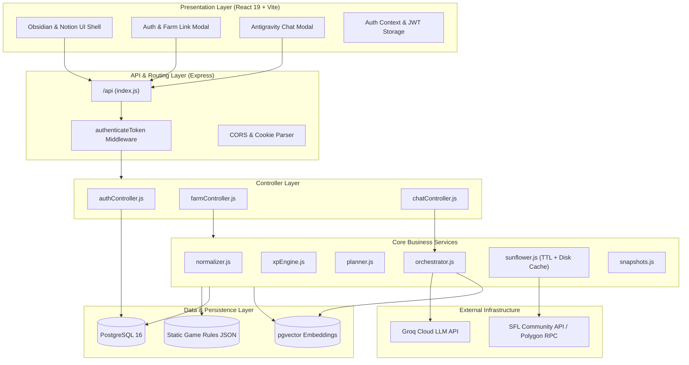

# 01. System Architecture 🏛️

## 1. Architectural Overview

Sunflower AI implements a clean **Client-Server MVC (Model-View-Controller)** pattern augmented with specialized computational and AI reasoning services. 

The architecture guarantees high scalability, strict tenant isolation, real-time blockchain state synchronization, and resilient fallback handling under third-party API rate limits.



---

## 2. Layered Architecture Breakdown

### 2.1 Presentation Layer (Frontend SPA)
The client is built using **React 19** and bundled with **Vite**:
- **Dual-Pane Desktop Layout**: Inspired by **Obsidian** (top window tabs, live status bar, tool ribbon) and **Notion** (document view canvas, properties drawer, block cards).
- **Discord-Style Mobile Dock**: For screens `< 768px`, the expandable sidebar is disabled to prevent squishing the canvas. Navigation collapses into a permanent `w-12` vertical icon dock with user profile popovers.
- **State Management**: React native hooks (`useState`, `useEffect`, `useContext`, `useRef`). Global authentication and user state are broadcast via `AuthContext`.
- **API Communication**: Dedicated fetch wrapper in `client/src/api.js` automatically attaching `Authorization: Bearer <token>` headers to all outbound requests.

### 2.2 Routing & Middleware Layer
All requests enter through `server/index.js` and are mounted under the `/api` prefix:
- **CORS Configuration**: Supports cross-origin credentials (`origin: process.env.CLIENT_URL || true, credentials: true`).
- **`authenticateToken` Middleware**: Intercepts requests to protected endpoints. Extracts JWTs from either the `Authorization: Bearer <token>` header or `token` cookies, validates signature, and attaches decoded payload (`req.user = { userId, username, farmId }`).
- **Connection Retry Engine**: The Express server implements an exponential backoff connection loop (`connectWithRetry`) to handle asynchronous startup dependencies when running in containerized environments (Docker Compose).

### 2.3 Controller Layer (MVC)
Separates HTTP transport protocols from application domain logic:
- `authController.js`: Manages user registration, login credentials verification, session lookup (`/api/auth/me`), farm ID association, and password updates.
- `farmController.js`: Orchestrates data collection from the blockchain/API, normalizes game state, invokes the cooking planner, and retrieves snapshot activity deltas.
- `chatController.js`: Handles conversational agent requests, managing session creation, conversational history retrieval, and session deletion.

### 2.4 Service & Computation Layer
The core intelligence and mathematical engine:
- `sunflower.js`: Communicates with external SFL endpoints. Implements in-memory TTL caching with atomic disk serialization and in-flight request deduplication to withstand rate limits (HTTP 429).
- `normalizer.js`: Converts raw polymorphic blockchain and API responses into a predictable, strongly-typed **Canonical Farm State**.
- `xpEngine.js`: Pure mathematical computation engine calculating food multipliers, skill masteries, ingredient purchase deficits, and batch production rates.
- `planner.js`: Optimization algorithm evaluating every building's recipes to identify top XP/FLOWER and XP/Hour execution strategies.
- `orchestrator.js`: Retrieval-Augmented Generation (RAG) agent that embeds conversation turns, retrieves context from `pgvector`, and generates strategic guidance via Groq LLMs.

### 2.5 Persistence Layer (PostgreSQL + pgvector)
PostgreSQL 16 serves as both relational and vector database:
- Relational tables: `users`, `snapshots`, `sessions`.
- Vector embeddings: `chat_messages` table with `embedding vector(384)` indexed with cosine-distance search.
- Connection pooling managed by `pg.Pool` with parameterized queries to eliminate SQL injection vulnerabilities.

---

## 3. Security Architecture

```
Client (Browser)                 Server (Express)                 Database (PostgreSQL)
       │                                │                                    │
       ├──── POST /api/auth/login ─────►│                                    │
       │    { username, password }      │                                    │
       │                                ├──── SELECT password_hash ─────────►│
       │                                │◄─── Return user row ───────────────┤
       │                                │                                    │
       │                                │ [bcrypt.compare(pw, hash)]         │
       │                                │ [jwt.sign({ userId, ... })]        │
       │◄─── 200 OK + JWT Token ────────┤                                    │
       │                                │                                    │
       ├──── GET /api/farm ────────────►│                                    │
       │    Bearer <token>              │ [jwt.verify(token)]                │
       │                                ├──── SELECT snapshots WHERE id=... ─►│
```

1. **Password Encryption**: All passwords stored using `bcrypt` with a minimum salt factor of 10. Passwords never appear in plaintext logs or API responses.
2. **Stateless JWT Authorization**: Cryptographically signed JSON Web Tokens (`HS256`) containing `userId`, `username`, and `farmId` with a 7-day expiration.
3. **Tenant Data Isolation**: Database queries enforce `WHERE user_id = $1` filters across all snapshot and chat queries, preventing cross-account access.
