# 01. System Architecture 🏛️

## 1. Architectural Overview

Sunflower AI implements a strongly-typed **Client-Server MVC (Model-View-Controller)** pattern augmented with specialized domain services organized by feature. 

The architecture guarantees high scalability, strict multi-tenant isolation, real-time blockchain state synchronization, and resilient fallback handling under third-party API rate limits.

```mermaid
graph TB
    subgraph Client["Presentation Layer (React 19 + Vite)"]
        UI[Obsidian & Notion UI Shell]
        AuthUI[Auth & Farm Link Modal]
        ChatUI[Antigravity Chat Modal]
        CreditsUI[AI Credits Badge & Quota]
        SessionUI[Session Conflict Modal]
        Ctx[Auth Context & JWT Storage]
    end

    subgraph Gateway["API Gateway & Middleware (Express + TypeScript)"]
        Router["/api (server/index.ts)"]
        IPGate["ipGate Middleware (1-Account/IP)"]
        AuthMid["authenticateToken Middleware"]
        CORS["CORS & Cookie Parser"]
    end

    subgraph Controllers["Controller Layer (Class-Based)"]
        AC["AuthController.ts"]
        FC["FarmController.ts"]
        CC["ChatController.ts (Credit Reservation)"]
    end

    subgraph CoreEngines["Pure Deterministic Core Engines (server/core/)"]
        DelivEng["economyEngine/deliveries.ts"]
        CostEng["economyEngine/cost.ts"]
        ProdEng["productionEngine/production.ts"]
        EffectEng["effectEngine/resolution.ts"]
    end

    subgraph ModularServices["Modular Service Layer (server/services/)"]
        subgraph FarmDomain["farm/"]
            SFL["SunflowerClient.ts (TTL + Disk Cache)"]
            Norm["FarmNormalizer.ts"]
            Snap["SnapshotService.ts"]
            Act["ActivityService.ts"]
        end
        subgraph CookingDomain["cooking/"]
            XPEng["XpEngine.ts"]
            Rec["RecipeService.ts"]
            Plan["PlannerService.ts"]
        end
        subgraph AIDomain["ai/"]
            Orch["Orchestrator.ts (15-Tool Agent Loop)"]
            GroqClient["GroqClient.ts"]
        end
        subgraph AuthDomain["auth/"]
            AuthSvc["AuthService.ts (IP Gate & Sessions)"]
        end
        subgraph ChatDomain["chat/"]
            ChatStore["ChatStoreService.ts (ONNX Embeddings)"]
        end
    end

    subgraph Models["Model Layer (server/models/)"]
        UserMdl["UserModel.ts (Credits & IP)"]
        SessMdl["SessionModel.ts (Device Caps)"]
        SnapMdl["Snapshot.ts"]
        ChatMdl["ChatMessage.ts"]
    end

    subgraph Storage["Data & Persistence Layer"]
        PG[(PostgreSQL 16)]
        Redis[(Redis 7 Hot Store)]
        PGV[(pgvector Cosine Embeddings)]
        RuleFiles[(Static Game Rules JSON)]
    end

    subgraph External["External Infrastructure"]
        SFL_API["SFL Community API / Polygon RPC"]
        Groq["Groq Cloud LLM API"]
    end

    UI --> Router
    AuthUI --> Router
    ChatUI --> Router
    Router --> IPGate
    IPGate --> AuthMid
    AuthMid --> Controllers

    AC --> AuthSvc
    AuthSvc --> UserMdl
    AuthSvc --> SessMdl
    FC --> SFL
    FC --> Norm
    FC --> Plan
    FC --> Snap
    FC --> Act
    FC --> DelivEng
    CC --> UserMdl
    CC --> Orch

    SFL --> SFL_API
    SFL --> Redis
    Orch --> Groq
    Orch --> ChatStore
    Orch --> DelivEng
    Orch --> CostEng
    Orch --> ProdEng
    Orch --> EffectEng
    ChatStore --> PGV
    Snap --> PG
    UserMdl --> PG
    SessMdl --> PG
    Plan --> XPEng
    Plan --> Rec
    Plan --> RuleFiles
```



---

## 2. Layered Architecture Breakdown

### 2.1 Presentation Layer (Frontend SPA)
The client is built using **React 19** and bundled with **Vite 6**:
- **Dual-Pane Desktop Layout**: Inspired by **Obsidian** (top window tabs, live status bar, tool ribbon) and **Notion** (document view canvas, properties drawer, block cards).
- **Discord-Style Mobile Dock**: For screens `< 768px`, the collapsible sidebar is disabled to prevent canvas distortion. Navigation collapses into a permanent `w-12` vertical icon dock with user profile popovers.
- **State Management**: Native React hooks (`useState`, `useEffect`, `useContext`, `useRef`). Global authentication and user state are broadcast via `AuthContext`.
- **API Communication**: Dedicated fetch wrapper in `client/src/api.js` automatically attaching `Authorization: Bearer <token>` headers to all outbound requests:

```javascript
// client/src/api.js - Central HTTP Client with Bearer token injection
const getAuthHeaders = () => {
  const token = localStorage.getItem('token');
  return token ? { 'Authorization': `Bearer ${token}` } : {};
};

const request = async (url, options = {}) => {
  const res = await fetch(url, {
    ...options,
    credentials: 'include',
    headers: {
      'Content-Type': 'application/json',
      ...getAuthHeaders(),
      ...options.headers,
    },
  });
  if (!res.ok) {
    const err = await res.json().catch(() => ({ error: 'Network error' }));
    throw new Error(err.error || `HTTP ${res.status}`);
  }
  return res.json();
};
```

---

### 2.2 Routing & Middleware Layer
All requests enter through `server/index.ts` and are mounted under `/api`:
- **CORS Configuration**: Supports cross-origin credentials (`origin: process.env.CLIENT_URL || true, credentials: true`).
- **`authenticateToken` Middleware**: Intercepts requests to protected endpoints. Extracts JWTs from either the `Authorization: Bearer <token>` header or `token` cookies, validates signature, and attaches decoded payload (`req.user = { userId, username, farmId }`).
- **Connection Retry Engine**: The Express server implements an exponential backoff connection loop (`connectWithRetry`) to handle asynchronous startup dependencies when running in containerized environments (Docker Compose).

```typescript
// server/middleware/auth.ts - Token verification and tenant extraction
export async function authenticateToken(req: Request, res: Response, next: NextFunction) {
  const authHeader = req.headers['authorization'];
  const token = (authHeader && authHeader.split(' ')[1]) || req.cookies?.token;

  if (!token) {
    return res.status(401).json({ error: 'Access token required' });
  }

  try {
    const user = authService.verifyToken(token);
    req.user = user;
    next();
  } catch (err) {
    return res.status(403).json({ error: 'Invalid or expired token' });
  }
}
```

---

### 2.3 Class-Based Controller Layer
Controllers separate HTTP transport protocols from application domain logic:
- `AuthController.ts`: Manages user registration, login credentials verification, session lookup (`/api/auth/me`), farm ID association, and password updates.
- `FarmController.ts`: Orchestrates data collection from the blockchain/API, normalizes game state, invokes the cooking planner, and retrieves snapshot activity deltas.
- `ChatController.ts`: Handles conversational agent requests, managing session creation, conversational history retrieval, and session deletion.

```typescript
// server/controllers/FarmController.ts - Class-based controller example
export class FarmController {
  async getFarmData(req: Request, res: Response) {
    try {
      const farmId = (req.query.farmId as string) || req.user?.farmId;
      if (!farmId) return res.status(400).json({ error: 'Farm ID required' });

      const { canonical, stale, cached } = await sunflowerClient.getFarm(farmId);

      // Persist snapshot in background if user is authenticated
      if (req.user?.userId) {
        snapshotService.save(canonical, req.user.userId).catch((err) => {
          console.error('Background snapshot error:', err);
        });
      }

      return res.json({ farm: canonical, stale, cached });
    } catch (err: unknown) {
      return res.status(500).json({ error: (err as Error).message });
    }
  }

  async getPlanner(req: Request, res: Response) {
    try {
      const farmId = (req.query.farmId as string) || req.user?.farmId;
      const [{ canonical }, { prices }] = await Promise.all([
        sunflowerClient.getFarm(farmId),
        sunflowerClient.getPrices(),
      ]);

      const plan = plannerService.plan(
        canonical,
        prices,
        recipes as unknown as Record<string, unknown>,
        items as unknown as Record<string, unknown>,
        modifiers as unknown as Record<string, unknown>
      );

      return res.json(plan);
    } catch (err: unknown) {
      return res.status(500).json({ error: (err as Error).message });
    }
  }
}

export const farmController = new FarmController();
```

---

### 2.4 Modular Service & Computation Layer
The core intelligence is organized into modular feature domains under `server/services/`:

#### 1. Farm Ingestion Domain (`server/services/farm/`)
- `SunflowerClient.ts`: Community API client. Implements in-memory TTL caching with atomic disk serialization and in-flight request deduplication via `Map` to prevent 429 errors.
- `FarmNormalizer.ts`: Converts raw polymorphic blockchain and API responses into a predictable, strongly-typed `CanonicalFarmState`.
- `SnapshotService.ts`: SHA-1 deduplication and PostgreSQL time-series persistence.
- `ActivityService.ts`: Exact observed on-chain counters and inferred inventory/XP movements between snapshots.

```typescript
// server/services/farm/SunflowerClient.ts - In-Flight Deduplication & Tiered Cache
export class SunflowerClient {
  private memCache: Record<string, CacheEntry> = {};
  private pending = new Map<string, Promise<unknown>>();

  private async cached<T>(key: string, ttl: number, fn: () => Promise<T>): Promise<T & { stale: boolean; cached: boolean }> {
    const hit = this.memCache[key];
    if (hit && Date.now() - hit.at < ttl) {
      return { ...(hit.data as T), stale: false, cached: true };
    }

    // In-flight dedup: return existing promise if already fetching
    if (this.pending.has(key)) {
      return this.pending.get(key) as Promise<T & { stale: boolean; cached: boolean }>;
    }

    const promise = fn()
      .then((data) => {
        this.memCache[key] = { at: Date.now(), data };
        this.saveDiskCache();
        return { ...data, stale: false, cached: false };
      })
      .catch((e) => {
        if (hit) {
          console.warn(`⚠️ API error for "${key}", serving stale cache: ${(e as Error).message}`);
          return { ...(hit.data as T), stale: true, error: String(e), cached: true };
        }
        throw e;
      })
      .finally(() => {
        this.pending.delete(key);
      });

    this.pending.set(key, promise);
    return promise as Promise<T & { stale: boolean; cached: boolean }>;
  }
}
```

#### 2. Cooking Optimization Domain (`server/services/cooking/`)
- `XpEngine.ts`: Pure mathematical engine calculating multiplicative skill boosts (*Munching Mastery*, *Drive-Through Deli*, *Juicy Boost*, *Fishy Feast*, *Buzzworthy Treats*), VIP Membership (+10%), oil cook time reductions, and batch yields (*Double Nom*).
- `RecipeService.ts`: Recursive dependency tree expansion (`expand`), intermediate cook time accumulation, and market purchase cost calculation (`cost`).
- `PlannerService.ts`: Optimization algorithm evaluating every building's recipes to identify top XP/FLOWER and XP/Hour execution strategies and Level 100 milestone estimates.

```typescript
// server/services/cooking/PlannerService.ts - Optimal Recipe Evaluation
export class PlannerService {
  plan(farm: CanonicalFarmState, prices: MarketPrice, recipes: Record<string, unknown>, items: Record<string, unknown>, modifiers: Record<string, unknown>): CookingPlan {
    const remaining = Math.max(L100 - farm.bumpkin.xp, 0);
    const perBuilding: Record<string, CookingPlanCandidate> = {};

    for (const [name, recipe] of Object.entries(recipes)) {
      if (name.startsWith('_')) continue;
      const r = recipe as RecipeDefinition;
      // Filter strictly by buildings the player actually owns
      if (!(r.building in farm.buildings)) continue;

      const eff = xpEngine.effective(name, r, farm, modifiers);
      const dep = recipeService.expand(name, recipes, 0, eff.ingredientMultiplier ?? 1);
      const c = recipeService.cost(dep.base, prices, items, farm.inventory);
      const totalMinutes = eff.minutes + dep.intermediateMinutes;
      const flowerCost = +(c.totalFlower > 0 ? c.totalFlower : c.flower > 0 ? c.flower : 0.0001).toFixed(5);
      const batchesToLevel100 = Math.ceil(remaining / eff.batchXp);
      const totalMilestoneFlower = +(batchesToLevel100 * flowerCost).toFixed(2);

      const cand: CookingPlanCandidate = {
        recipe: name,
        batchXp: eff.batchXp,
        flowerCost,
        flowerToBuy: +c.flower.toFixed(5),
        xpPerFlower: Math.round(eff.batchXp / flowerCost),
        xpPerHour: Math.round(eff.batchXp / (totalMinutes / 60)),
        batchesToLevel100,
        totalMilestoneFlower,
        totalMinutes,
        buy: c.buy,
        mustProduce: c.mustProduce,
      };

      const cur = perBuilding[r.building];
      if (!cur || cand.xpPerFlower > cur.xpPerFlower) perBuilding[r.building] = cand;
    }

    // Aggregate best candidates into final plan...
    return { /* ... */ };
  }
}
```

#### 3. Pure Deterministic Calculation Engines (`server/core/`)
- `economyEngine/deliveries.ts`: Pure, deterministic evaluation of Codex Deliveries, Weekly Chores, and Poppy Mega Bounties with SHA-256 cryptographic provenance.
  - Evaluates Coin deliveries, SFL orders, and Ascension Age seasonal Shiny Feathers based on NPC tiers (Elite: 6, Medium: 3, Standard: 2) with active VIP Membership boosts (+3 Feathers / +15 to +45 Ascension points).
  - Tracks ingredient readiness (`readyNow`), market ingredient FLOWER cost, net SFL profit, and return on investment.
  - Maps Weekly Chores against `farmActivity` counters (`currentProgress = farmActivity[activityName] - initialProgress`).
  - Evaluates the Poppy Mega Bounty board across 6 distinct categories (Flowers, Fish, Crustaceans, Animals, Artefacts, Giant Crops).
- `economyEngine/cost.ts`: Evaluates animal produce economics (Milk, Eggs, Wool) strictly from market prices, comparing feed costs vs market purchases with zero hardcoded prices.
- `productionEngine/production.ts`: Projects yields, busy timers, and active pipeline completion across cooking buildings, crops, and animal barns.
- `effectEngine/resolution.ts`: Resolves placed collectibles, equipped wearables, and seasonal conditions into an authoritative `EffectContext`.

#### 4. AI Agent Domain (`server/services/ai/`)
- `Orchestrator.ts`: Autonomous agent loop implementing **PLAN → ACT → CHECK → FIX** across up to 8 conversational rounds. It calls **15 specialized deterministic tools**:
  1. `get_farm_state`: Normalized inventory, level, XP, currencies, buildings, skills from snapshots or hot store.
  2. `get_roadmap`: Multi-phase tactical roadmap with daily objectives and resource commitments.
  3. `check_action_permission`: Discretionary balance and hard reserve constraint validator.
  4. `evaluate_strategy_feasibility`: Recipe or crafting feasibility check against budgets and deadlines.
  5. `get_temporal_context`: In-game Sunflower clock, day boundary, and seasonal urgency index.
  6. `get_history_metrics`: Historical deltas with strict observed vs inferred separation.
  7. `compute_recipe_cost`: Effective recipe economics with building ownership verification gates.
  8. `get_active_effects`: Resolution of placed collectibles, equipped wearables, and timed buffs.
  9. `get_market_prices`: Live P2P community market orderbook prices in FLOWER.
  10. `recall_memory`: Semantic vector search across past archived conversational sessions (`pgvector`).
  11. `get_item_metadata`: Static game metadata lookup with collision disambiguation.
  12. `get_expansion_details`: Multi-island progression requirements (Desert, Volcano, etc.).
  13. `evaluate_buy_vs_farm`: Feed vs market ROI breakdown for animal produce (Milk, Eggs, Wool).
  14. `get_deliveries`: Evaluates NPC delivery orders sorted by profit, Coins, SFL, and `readyNow` status.
  15. `get_codex_chores_and_bounties`: Evaluates Weekly Chores and Poppy Mega Bounties with live progress.
- **Anti-Hallucination Real-Examples Disambiguation (Rule 9)**: When player intent is ambiguous, Dr. Bumpkin is strictly forbidden from using fake system placeholders (e.g. `"Delivery 1 - Milk & Eggs"`). It MUST always cite real, active orders and chores directly from the player's Codex board with NPC names, exact ingredients, and actual rewards.
- Supports tool-level deduplication bypass with `force: true`.

---

### 2.5 Persistence & Hot Cache Layer
PostgreSQL 16 provides transactional ACID persistence and vector similarity search, augmented with Redis 7 for live state projections:
- **Relational & Auth Tables**:
  - `users`: ID, username, email, `password_hash`, `farm_id`, `registration_ip`, `role`, `ai_credits`, `ai_credits_used`.
  - `active_sessions`: Strict concurrent session tracking with `(user_id, device_type)` unique constraint and SHA-256 hashed refresh tokens.
  - `snapshots`: Time-series farm states indexed by `(user_id, created_at DESC)`.
- **Vector Search Table**:
  - `chat_messages`: Vector embeddings (`vector(384)`) generated by `@xenova/transformers`, queried using cosine distance (`<=>` operator).
- **Redis 7 Hot Store**:
  - In-memory monotonic farm state projection caching canonical and raw blockchain states for rapid agent reads.
  - Includes transparent in-memory fallback (`MemoryHotStore`) for hermetic local test runs and offline development.

---

## 3. Security & Governance Architecture

```
Client (Browser / Mobile)                 Server (Express API)                 Database / Redis
       │                                         │                                    │
       ├──── POST /api/auth/register ───────────►│                                    │
       │    { username, pw, email }              ├──── SELECT id FROM users ─────────►│
       │                                         │     WHERE registration_ip = $1     │
       │                                         │◄─── [If exists: 409 Conflict] ─────┤
       │                                         │                                    │
       ├──── POST /api/auth/login ──────────────►│                                    │
       │    { username, password, deviceType }   ├──── SELECT * FROM active_sessions ─►│
       │                                         │     WHERE user_id = $1             │
       │                                         │     AND device_type = $2           │
       │                                         │◄─── [If active & !force: 409] ─────┤
       │                                         │                                    │
       │                                         │ [bcrypt.compare(pw, hash)]         │
       │                                         │ [Issue 15m Access + 30d Refresh]   │
       │◄─── 200 OK + JWT Tokens ────────────────┤                                    │
       │                                         │                                    │
       ├──── POST /api/chat { message } ────────►│                                    │
       │    Bearer <access_token>                ├──── UPDATE users SET               │
       │                                         │     ai_credits = ai_credits - 1    │
       │                                         │     WHERE id = $1 AND              │
       │                                         │     ai_credits >= 1 RETURNING ... ─►│
       │                                         │◄─── [Credit Reserved] ─────────────┤
       │                                         │ [Run 15-Tool Agent Loop]           │
       │                                         │ (If AI error -> Auto-Refund +1)    │
       │◄─── 200 OK + Answer & Credits ──────────┤                                    │
```

1. **One-Account-Per-IP Sybil Protection**:
   - `ipGate.ts` and `AuthService.ts` record client IP address (`req.headers['x-forwarded-for']` or `req.ip`) during registration.
   - Restricts public user accounts to 1 registration per IP address to prevent Sybil bot farms.
   - Developer accounts (`username === 'dev'` or `role === 'DEVELOPER'`) are explicitly exempted.

2. **Concurrent Dual-Device Session Cap (1 Desktop + 1 Mobile)**:
   - Tracks active sessions in `active_sessions` with device classification (`desktop` vs `mobile`).
   - If a user attempts to log into a second desktop while an active desktop session exists, the server returns a `409 SESSION_CONFLICT` requiring explicit confirmation.
   - When confirmed with `forceDisconnect: true`, the previous session's refresh token is deleted and invalidated immediately.

3. **Atomic AI Credit Quota & Usage Ledger**:
   - Pre-allocates credits using atomic SQL condition:
     ```sql
     UPDATE users
     SET ai_credits = ai_credits - $2,
         ai_credits_used = ai_credits_used + $2
     WHERE id = $1 AND ai_credits >= $2
     RETURNING ai_credits, ai_credits_used;
     ```
   - Guarantees zero negative balances under race conditions.
   - Automated rollback refund (`addAiCredits(userId, 1)`) restores reserved credits if LLM inference fails.
   - Developer accounts have unlimited credits (999,999) and bypass deduction.

4. **Stateless JWT Authorization & Tenant Isolation**:
   - Short-lived 15-minute access tokens for API authorization paired with 30-day refresh tokens.
   - Strict `WHERE user_id = $1` tenant isolation on all database queries.

