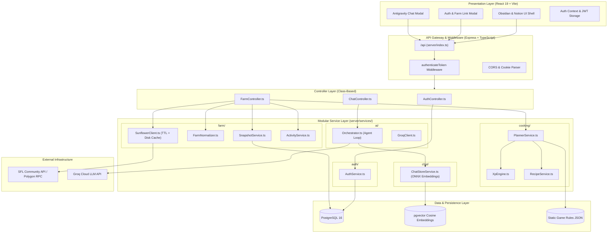

# 01. System Architecture 🏛️

## 1. Architectural Overview

Sunflower AI implements a strongly-typed **Client-Server MVC (Model-View-Controller)** pattern augmented with specialized domain services organized by feature. 

The architecture guarantees high scalability, strict multi-tenant isolation, real-time blockchain state synchronization, and resilient fallback handling under third-party API rate limits.



---

## 2. Layered Architecture Breakdown

### 2.1 Presentation Layer (Frontend SPA)
The client is built using **React 19** and bundled with **Vite 6**:
- **Dual-Pane Desktop Layout**: Inspired by **Obsidian** (top window tabs, live status bar, tool ribbon) and **Notion** (document view canvas, properties drawer, block cards).
- **Discord-Style Mobile Dock**: For screens `< 768px`, the collapsible sidebar is disabled to prevent canvas distortion. Navigation collapses into a permanent `w-12` vertical icon dock with user profile popovers.
- **State Management**: Native React hooks (`useState`, `useEffect`, `useContext`, `useRef`). Global authentication and user state are broadcast via `AuthContext`.
- **API Communication**: Dedicated fetch wrapper in `client/src/api.js` automatically attaching `Authorization: Bearer <token>` headers to all outbound requests:

```javascript
// client/src/api.js - Central HTTP Client with Bearer token injection
const getAuthHeaders = () => {
  const token = localStorage.getItem('token');
  return token ? { 'Authorization': `Bearer ${token}` } : {};
};

const request = async (url, options = {}) => {
  const res = await fetch(url, {
    ...options,
    credentials: 'include',
    headers: {
      'Content-Type': 'application/json',
      ...getAuthHeaders(),
      ...options.headers,
    },
  });
  if (!res.ok) {
    const err = await res.json().catch(() => ({ error: 'Network error' }));
    throw new Error(err.error || `HTTP ${res.status}`);
  }
  return res.json();
};
```

---

### 2.2 Routing & Middleware Layer
All requests enter through `server/index.ts` and are mounted under `/api`:
- **CORS Configuration**: Supports cross-origin credentials (`origin: process.env.CLIENT_URL || true, credentials: true`).
- **`authenticateToken` Middleware**: Intercepts requests to protected endpoints. Extracts JWTs from either the `Authorization: Bearer <token>` header or `token` cookies, validates signature, and attaches decoded payload (`req.user = { userId, username, farmId }`).
- **Connection Retry Engine**: The Express server implements an exponential backoff connection loop (`connectWithRetry`) to handle asynchronous startup dependencies when running in containerized environments (Docker Compose).

```typescript
// server/middleware/auth.ts - Token verification and tenant extraction
export async function authenticateToken(req: Request, res: Response, next: NextFunction) {
  const authHeader = req.headers['authorization'];
  const token = (authHeader && authHeader.split(' ')[1]) || req.cookies?.token;

  if (!token) {
    return res.status(401).json({ error: 'Access token required' });
  }

  try {
    const user = authService.verifyToken(token);
    req.user = user;
    next();
  } catch (err) {
    return res.status(403).json({ error: 'Invalid or expired token' });
  }
}
```

---

### 2.3 Class-Based Controller Layer
Controllers separate HTTP transport protocols from application domain logic:
- `AuthController.ts`: Manages user registration, login credentials verification, session lookup (`/api/auth/me`), farm ID association, and password updates.
- `FarmController.ts`: Orchestrates data collection from the blockchain/API, normalizes game state, invokes the cooking planner, and retrieves snapshot activity deltas.
- `ChatController.ts`: Handles conversational agent requests, managing session creation, conversational history retrieval, and session deletion.

```typescript
// server/controllers/FarmController.ts - Class-based controller example
export class FarmController {
  async getFarmData(req: Request, res: Response) {
    try {
      const farmId = (req.query.farmId as string) || req.user?.farmId;
      if (!farmId) return res.status(400).json({ error: 'Farm ID required' });

      const { canonical, stale, cached } = await sunflowerClient.getFarm(farmId);

      // Persist snapshot in background if user is authenticated
      if (req.user?.userId) {
        snapshotService.save(canonical, req.user.userId).catch((err) => {
          console.error('Background snapshot error:', err);
        });
      }

      return res.json({ farm: canonical, stale, cached });
    } catch (err: unknown) {
      return res.status(500).json({ error: (err as Error).message });
    }
  }

  async getPlanner(req: Request, res: Response) {
    try {
      const farmId = (req.query.farmId as string) || req.user?.farmId;
      const [{ canonical }, { prices }] = await Promise.all([
        sunflowerClient.getFarm(farmId),
        sunflowerClient.getPrices(),
      ]);

      const plan = plannerService.plan(
        canonical,
        prices,
        recipes as unknown as Record<string, unknown>,
        items as unknown as Record<string, unknown>,
        modifiers as unknown as Record<string, unknown>
      );

      return res.json(plan);
    } catch (err: unknown) {
      return res.status(500).json({ error: (err as Error).message });
    }
  }
}

export const farmController = new FarmController();
```

---

### 2.4 Modular Service & Computation Layer
The core intelligence is organized into modular feature domains under `server/services/`:

#### 1. Farm Ingestion Domain (`server/services/farm/`)
- `SunflowerClient.ts`: Community API client. Implements in-memory TTL caching with atomic disk serialization and in-flight request deduplication via `Map` to prevent 429 errors.
- `FarmNormalizer.ts`: Converts raw polymorphic blockchain and API responses into a predictable, strongly-typed `CanonicalFarmState`.
- `SnapshotService.ts`: SHA-1 deduplication and PostgreSQL time-series persistence.
- `ActivityService.ts`: Exact observed on-chain counters and inferred inventory/XP movements between snapshots.

```typescript
// server/services/farm/SunflowerClient.ts - In-Flight Deduplication & Tiered Cache
export class SunflowerClient {
  private memCache: Record<string, CacheEntry> = {};
  private pending = new Map<string, Promise<unknown>>();

  private async cached<T>(key: string, ttl: number, fn: () => Promise<T>): Promise<T & { stale: boolean; cached: boolean }> {
    const hit = this.memCache[key];
    if (hit && Date.now() - hit.at < ttl) {
      return { ...(hit.data as T), stale: false, cached: true };
    }

    // In-flight dedup: return existing promise if already fetching
    if (this.pending.has(key)) {
      return this.pending.get(key) as Promise<T & { stale: boolean; cached: boolean }>;
    }

    const promise = fn()
      .then((data) => {
        this.memCache[key] = { at: Date.now(), data };
        this.saveDiskCache();
        return { ...data, stale: false, cached: false };
      })
      .catch((e) => {
        if (hit) {
          console.warn(`⚠️ API error for "${key}", serving stale cache: ${(e as Error).message}`);
          return { ...(hit.data as T), stale: true, error: String(e), cached: true };
        }
        throw e;
      })
      .finally(() => {
        this.pending.delete(key);
      });

    this.pending.set(key, promise);
    return promise as Promise<T & { stale: boolean; cached: boolean }>;
  }
}
```

#### 2. Cooking Optimization Domain (`server/services/cooking/`)
- `XpEngine.ts`: Pure mathematical engine calculating multiplicative skill boosts (*Munching Mastery*, *Drive-Through Deli*, *Juicy Boost*, *Fishy Feast*, *Buzzworthy Treats*), VIP Membership (+10%), oil cook time reductions, and batch yields (*Double Nom*).
- `RecipeService.ts`: Recursive dependency tree expansion (`expand`), intermediate cook time accumulation, and market purchase cost calculation (`cost`).
- `PlannerService.ts`: Optimization algorithm evaluating every building's recipes to identify top XP/FLOWER and XP/Hour execution strategies and Level 100 milestone estimates.

```typescript
// server/services/cooking/PlannerService.ts - Optimal Recipe Evaluation
export class PlannerService {
  plan(farm: CanonicalFarmState, prices: MarketPrice, recipes: Record<string, unknown>, items: Record<string, unknown>, modifiers: Record<string, unknown>): CookingPlan {
    const remaining = Math.max(L100 - farm.bumpkin.xp, 0);
    const perBuilding: Record<string, CookingPlanCandidate> = {};

    for (const [name, recipe] of Object.entries(recipes)) {
      if (name.startsWith('_')) continue;
      const r = recipe as RecipeDefinition;
      // Filter strictly by buildings the player actually owns
      if (!(r.building in farm.buildings)) continue;

      const eff = xpEngine.effective(name, r, farm, modifiers);
      const dep = recipeService.expand(name, recipes, 0, eff.ingredientMultiplier ?? 1);
      const c = recipeService.cost(dep.base, prices, items, farm.inventory);
      const totalMinutes = eff.minutes + dep.intermediateMinutes;
      const flowerCost = +(c.totalFlower > 0 ? c.totalFlower : c.flower > 0 ? c.flower : 0.0001).toFixed(5);
      const batchesToLevel100 = Math.ceil(remaining / eff.batchXp);
      const totalMilestoneFlower = +(batchesToLevel100 * flowerCost).toFixed(2);

      const cand: CookingPlanCandidate = {
        recipe: name,
        batchXp: eff.batchXp,
        flowerCost,
        flowerToBuy: +c.flower.toFixed(5),
        xpPerFlower: Math.round(eff.batchXp / flowerCost),
        xpPerHour: Math.round(eff.batchXp / (totalMinutes / 60)),
        batchesToLevel100,
        totalMilestoneFlower,
        totalMinutes,
        buy: c.buy,
        mustProduce: c.mustProduce,
      };

      const cur = perBuilding[r.building];
      if (!cur || cand.xpPerFlower > cur.xpPerFlower) perBuilding[r.building] = cand;
    }

    // Aggregate best candidates into final plan...
    return { /* ... */ };
  }
}
```

#### 3. AI Agent Domain (`server/services/ai/`)
- `Orchestrator.ts`: Autonomous agent loop implementing **PLAN → ACT → CHECK → FIX** across up to 8 conversational rounds. It calls live tools to inspect farm state, prices, planner output, and land expansion rules before answering.
- Supports tool-level deduplication bypass with `force: true`.
- Enforces building ownership validation when evaluating recipe costs.

---

### 2.5 Persistence Layer (PostgreSQL 16 + pgvector)
PostgreSQL 16 provides transactional ACID persistence and vector similarity search:
- Relational tables: `users`, `snapshots`, `sessions`.
- Vector search: `chat_messages` table with an `embedding vector(384)` column generated by `@xenova/transformers`. Queries utilize cosine distance (`<=>` operator).
- Connection pooling via `pg.Pool` with parameterized queries to eliminate SQL injection vulnerabilities.

---

## 3. Security Architecture

```
Client (Browser)                 Server (Express)                 Database (PostgreSQL)
       │                                │                                    │
       ├──── POST /api/auth/login ─────►│                                    │
       │    { username, password }      │                                    │
       │                                ├──── SELECT password_hash ─────────►│
       │                                │◄─── Return user row ───────────────┤
       │                                │                                    │
       │                                │ [bcrypt.compare(pw, hash)]         │
       │                                │ [jwt.sign({ userId, ... })]        │
       │◄─── 200 OK + JWT Token ────────┤                                    │
       │                                │                                    │
       ├──── GET /api/farm ────────────►│                                    │
       │    Bearer <token>              │ [jwt.verify(token)]                │
       │                                ├──── SELECT snapshots WHERE id=... ─►│
```

1. **Password Encryption**: Stored using `bcrypt` with salt factor 10. Passwords never appear in plaintext logs or API responses.
2. **Stateless JWT Authorization**: Cryptographically signed JSON Web Tokens (`HS256`) containing `userId`, `username`, and `farmId` with a 7-day expiration.
3. **Tenant Data Isolation**: Database queries enforce `WHERE user_id = $1` filters across all snapshot and chat queries, preventing cross-account access.

