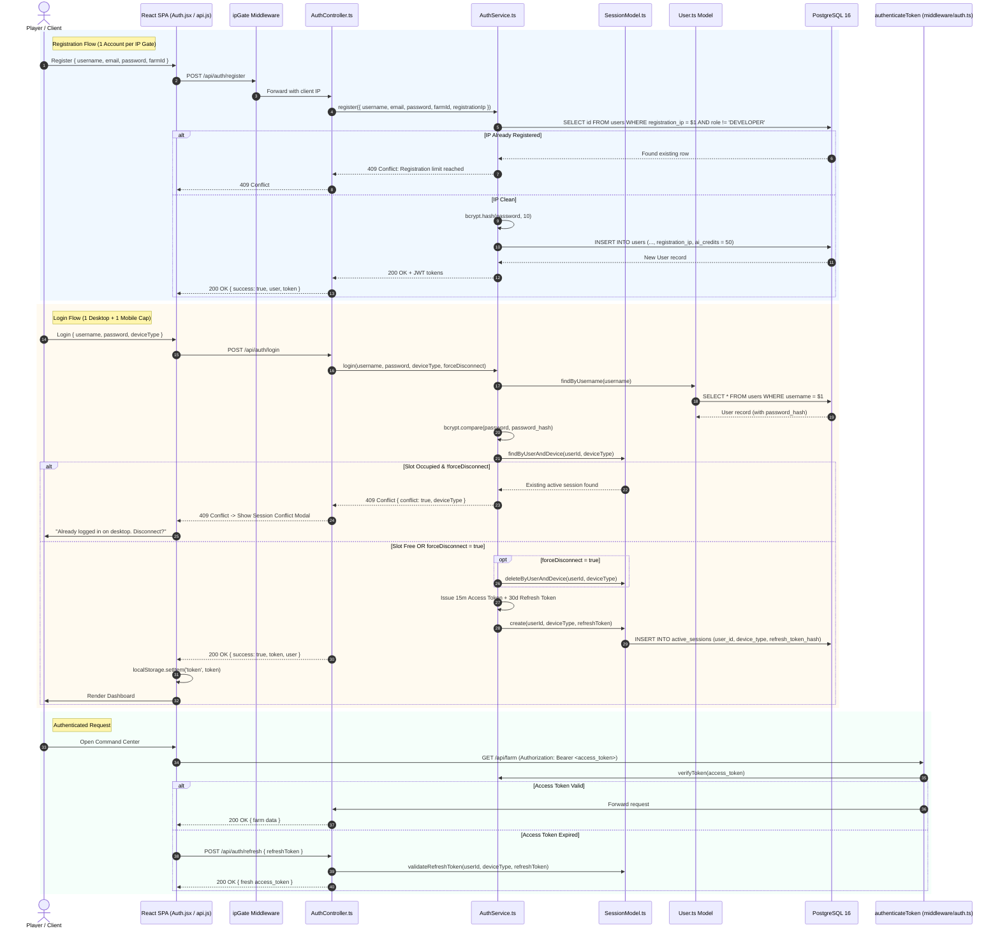

# 03. Authentication & Tenant Isolation Flow 🔐

## 1. Overview

Sunflower AI features a secure, multi-tenant authentication system that isolates user accounts, farm IDs, snapshot records, and AI conversational memory. 

Authentication is built around **bcrypt** for irreversible password hashing and **JSON Web Tokens (JWT)** for stateless request authorization, orchestrated by `AuthController.ts`, `AuthService.ts`, and the `User.ts` database model.

---

## 2. Authentication Sequence Diagram



---

## 3. Cryptographic Implementation

### 3.1 Password Hashing & Verification (`AuthService.ts`)
- **Algorithm**: `bcrypt`
- **Salt Factor**: `10`
- **Storage Field**: `password_hash VARCHAR(255)` in `users` table
- Plaintext passwords are never logged, transmitted in responses, or stored in session memory.

```typescript
// server/services/auth/AuthService.ts - Password hashing & verification
import bcrypt from 'bcryptjs';
import jwt from 'jsonwebtoken';
import { User } from '../../models/index.js';

export class AuthService {
  private readonly saltRounds = 10;
  private readonly secret = process.env.JWT_SECRET || 'dev_secret_fallback';

  async hashPassword(password: string): Promise<string> {
    return bcrypt.hash(password, this.saltRounds);
  }

  async verifyPassword(password: string, hash: string): Promise<boolean> {
    return bcrypt.compare(password, hash);
  }

  generateToken(user: { id: number; username: string; farm_id?: string | null }): string {
    return jwt.sign(
      { userId: user.id, username: user.username, farmId: user.farm_id },
      this.secret,
      { expiresIn: '7d' }
    );
  }

  verifyToken(token: string): { userId: number; username: string; farmId?: string | null } {
    return jwt.verify(token, this.secret) as { userId: number; username: string; farmId?: string | null };
  }
}

export const authService = new AuthService();
```

---

### 3.2 Dual-Token Architecture & Refresh Mechanism
Sunflower AI implements a hardened dual-token authentication model:
- **Access Token**: Short-lived (default `15m`), signed with HMAC-SHA256 (`HS256`). Carried in `Authorization: Bearer <token>` headers or cookies.
  ```json
  {
    "userId": 42,
    "username": "bumpkin_farmer",
    "iat": 1773060000,
    "exp": 1773060900
  }
  ```
- **Refresh Token**: Long-lived (default `30d`), bound to device fingerprinting:
  ```json
  {
    "userId": 42,
    "username": "bumpkin_farmer",
    "deviceType": "desktop",
    "jti": "550e8400-e29b-41d4-a716-446655440000",
    "iat": 1773060000,
    "exp": 1775652000
  }
  ```
- **Token Hash Storage**: Only the cryptographic SHA-256 hash of the refresh token is stored in the `active_sessions` table (`refresh_token_hash`). If the database is compromised, active refresh tokens cannot be forged.

---

## 4. Concurrent Session Governance (1 Desktop + 1 Mobile)

To prevent account sharing while supporting cross-device gameplay, Sunflower AI enforces a strict limit of **1 Desktop session + 1 Mobile session** per user:

1. **Device Classification**: The client sends `deviceType: 'desktop' | 'mobile'` based on user agent detection.
2. **Conflict Detection**: `SessionModel.findByUserAndDevice(userId, deviceType)` checks if a session slot is currently occupied.
3. **User Handshake**:
   - If occupied and `forceDisconnect: false`, the server responds with HTTP `409 Conflict`:
     ```json
     {
       "success": false,
       "conflict": true,
       "deviceType": "desktop",
       "error": "You're already logged in on desktop. Disconnect that session to continue here."
     }
     ```
   - The frontend prompts the player with a **Session Conflict Modal**.
   - If the player chooses to take over the session, the client resubmits login with `forceDisconnect: true`.
4. **Session Invalidation**:
   - The server deletes the old session (`deleteByUserAndDevice`), immediately revoking the old refresh token.
   - The new session is inserted into `active_sessions`. Database unique index `idx_one_session_per_device_type` on `(user_id, device_type)` guarantees race safety under concurrent logins.

---

## 5. Protected Route Middleware (`server/middleware/auth.ts`)

The `authenticateToken` middleware acts as the primary gatekeeper for all private APIs:

```typescript
// server/middleware/auth.ts - Token verification and tenant extraction
import type { Request, Response, NextFunction } from 'express';
import { authService } from '../services/auth/index.js';

export function authenticateToken(req: Request, res: Response, next: NextFunction) {
  const authHeader = req.headers['authorization'];
  const token = (authHeader && authHeader.split(' ')[1]) || req.cookies?.token;

  if (!token) {
    return res.status(401).json({ error: 'Access token required' });
  }

  try {
    const decoded = authService.verifyToken(token);
    req.user = decoded;
    next();
  } catch (err) {
    return res.status(403).json({ error: 'Invalid or expired token' });
  }
}
```

---

## 6. Multi-Tenant Data Isolation

All data queries in Sunflower AI enforce strict multi-tenant isolation:

| Data Entity | Isolation Mechanism | SQL Enforcement |
|---|---|---|
| **Registration Guard** | Sybil prevention per public IP address. | `SELECT id FROM users WHERE registration_ip = $1 AND role != 'DEVELOPER'` |
| **Concurrent Sessions**| Maximum 1 active desktop + 1 active mobile session. | `SELECT * FROM active_sessions WHERE user_id = $1 AND device_type = $2` |
| **AI Credit Quota**    | Atomic balance reservation and automated refund. | `UPDATE users SET ai_credits = ai_credits - $2 WHERE id = $1 AND ai_credits >= $2` |
| **Farm State**         | Scoped to authenticated user's bound `farm_id`. | External SFL fetch scoped to `req.user.farmId` |
| **Historical Snapshots**| User-specific snapshot lookup. | `SELECT * FROM snapshots WHERE user_id = $1 ORDER BY created_at DESC;` |
| **AI Chat Sessions**   | Conversation sessions partition. | `SELECT DISTINCT session_id FROM chat_messages WHERE user_id = $1;` |
| **Vector RAG Retrieval**| Semantic memory search limited to user's history. | `WHERE user_id = $1 AND session_id != $2 ORDER BY embedding <=> $3 LIMIT 5;` |

