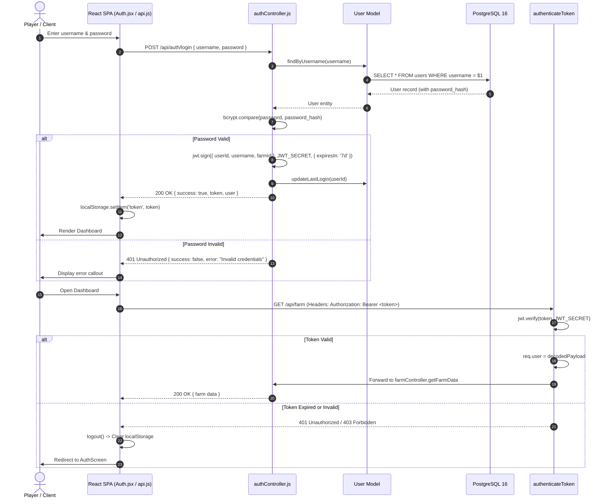

# 03. Authentication & Tenant Isolation Flow 🔐

## 1. Overview

Sunflower AI features a secure, multi-tenant authentication system that isolates user accounts, farm IDs, snapshot records, and AI conversational memory. 

Authentication is built around **bcrypt** for irreversible password hashing and **JSON Web Tokens (JWT)** for stateless request authorization.

---

## 2. Authentication Sequence Diagram



---

## 3. Cryptographic Specifications

### 3.1 Password Hashing
- **Algorithm**: `bcrypt`
- **Salt Factor**: `10`
- **Storage Field**: `password_hash VARCHAR(255)` in `users` table
- Plaintext passwords are never logged, transmitted in responses, or stored in session memory.

```javascript
// server/controllers/authController.js
const saltRounds = 10;
const passwordHash = await bcrypt.hash(password, saltRounds);
```

### 3.2 JWT Token Architecture
Tokens are cryptographically signed using HMAC-SHA256 (`HS256`):
- **Secret**: `process.env.JWT_SECRET` (fallback string with warning in non-production).
- **Expiration**: `7d` (7 days).
- **Token Payload**:
  ```json
  {
    "userId": 42,
    "username": "bumpkin_farmer",
    "farmId": "29411",
    "iat": 1773060000,
    "exp": 1773664800
  }
  ```

### 3.3 Token Transmission & Storage
1. **Frontend Storage**: The token is preserved in browser `localStorage.getItem('token')`.
2. **Request Injection**: All requests made via `client/src/api.js` automatically add the Authorization header:
   ```javascript
   const getAuthHeaders = () => {
     const token = localStorage.getItem('token');
     return token ? { 'Authorization': `Bearer ${token}` } : {};
   };
   ```
3. **Cookie Support**: Tokens are also mirrored in HTTP cookies (`token`), enabling cross-site session rehydration where headers are unavailable.

---

## 4. Protected Route Middleware

The `authenticateToken` middleware acts as the primary gatekeeper for all private APIs:

```javascript
// server/middleware/auth.js
export const authenticateToken = (req, res, next) => {
  // 1. Check Bearer Authorization header
  const authHeader = req.headers['authorization'];
  const token = authHeader && authHeader.split(' ')[1] || req.cookies?.token;

  if (!token) {
    return res.status(401).json({ success: false, error: 'Access token required' });
  }

  // 2. Verify signature and expiration
  jwt.verify(token, JWT_SECRET, (err, decoded) => {
    if (err) {
      return res.status(403).json({ success: false, error: 'Invalid or expired token' });
    }
    // 3. Attach identity to request pipeline
    req.user = decoded;
    next();
  });
};
```

---

## 5. Farm NFT Binding Flow (`PUT /api/auth/farm`)

Sunflower Land accounts are tied to an on-chain numeric NFT Farm ID.

1. **Input Validation**: The farm ID must be a valid positive integer string.
2. **Database Update**: The server updates the user's `farm_id` column:
   ```sql
   UPDATE users SET farm_id = $1, updated_at = CURRENT_TIMESTAMP WHERE id = $2 RETURNING *;
   ```
3. **Token Re-issuance**: The server re-signs a fresh JWT containing the updated `farmId` and sends it back to the client.
4. **Immediate State Rehydration**: `authContext.jsx` updates its internal state with the new token, allowing the UI to immediately load live blockchain data without requiring the player to log in again.

---

## 6. Multi-Tenant Data Isolation

All data queries in Sunflower AI enforce strict multi-tenant isolation:

| Data Entity | Isolation Mechanism |
|---|---|
| **Farm State** | Dynamically retrieved using the authenticated user's bound `farm_id`. |
| **Historical Snapshots** | `SELECT * FROM snapshots WHERE user_id = $1 ORDER BY created_at DESC;` |
| **AI Chat Sessions** | `SELECT DISTINCT session_id FROM chat_messages WHERE user_id = $1;` |
| **Vector RAG Retrieval** | Filtered by `user_id = $1` to ensure users cannot retrieve conversational history or farm data from other players. |
