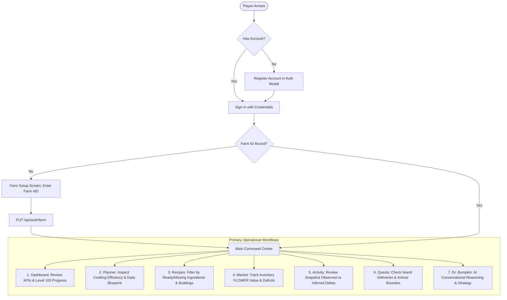

# 04. User Journeys & Operational Workflows 🧭

## 1. End-to-End User Journey Map

---

## 2. Detailed Operational Workflows

### 2.1 Onboarding & Farm NFT Association
1. **Account Registration**: The player signs up with a unique username, email, and password. A secure JWT is issued and stored in browser `localStorage`.
2. **Farm ID Discovery**: The player is guided to locate their Sunflower Land numeric Farm ID from the top-left HUD of the game (e.g. `#29411`).
3. **Binding & Validation**: Entering the numeric ID calls `PUT /api/auth/farm`. The server verifies the number, binds it to the user account in PostgreSQL, and rehydrates the auth session.
4. **Workspace Unlock**: The application transitions from the setup modal to the full Obsidian + Notion hybrid workspace.

### 2.2 Operational Dashboard (Overview)
- **Top KPI Strip**:
  - Bumpkin Level & active badge.
  - Current XP and remaining XP required for Level 100.
  - Liquid FLOWER balance (approximate treasury valuation).
  - Available Gold Coins.
- **Road to Level 100 Milestone Bar**: Visual progress percentage with gradient indicator reflecting progress toward the Level 100 milestone target (5,000,000 XP).
- **Active Cooking Pipeline**: Quick-look cards for each production building, displaying the top recommended recipe, verified state, batch XP yield, FLOWER cost, and cooking duration.

### 2.3 Cooking & XP Planner Workflow
- **Optimization Matrix Table**: A comprehensive Notion-style database view sorting all building candidate recipes by:
  - XP / Batch
  - FLOWER Cost
  - **XP / FLOWER Efficiency Ratio** (the gold-standard metric for frugal progression)
  - **XP / Cooking Hour** (the speed-run metric for fast progression)
- **Today's Action Blueprint**:
  - Crops to plant and harvest right now.
  - Market purchases required (missing tradable ingredients).
  - Untradable deficit alerts (milk, eggs, or crops that cannot be bought and must be farmed).

### 2.4 Recipe Catalogue Exploration
- **Building Tabs**: Switch effortlessly between Fire Pit, Kitchen, Bakery, Deli, and Smoothie Shack.
- **State Filtering**:
  - `All`: Full catalogue for the active building.
  - `✓ Ready`: Recipes where 100% of required ingredients exist in current inventory.
  - `Missing`: Recipes missing one or more ingredients.
- **Skill Boost Indicators**: Displays active skill multipliers (e.g. *Munching Mastery* +5% XP, *Drive-Through Deli* +15% XP) and batch yields (*Double Nom* ×2 food).

### 2.5 Market Valuation & Inventory Arbitrage
- **Total Inventory Valuation**: Calculates the aggregate liquid worth of all stored crops, animal items, and consumables in FLOWER.
- **In-Stock Toggle**: Switch between "Show All Items" and "✓ In Stock Only" to review active assets.
- **Sorting Options**: Sort inventory cards by total value (descending), unit price, or alphabetically.
- **Deficit Calculation**: Visual indicators displaying whether an ingredient should be purchased from the orderbook or produced on-farm.

### 2.6 Snapshot Activity & Delta Analysis
- **Observation Window**: Automatically compares the two most recent farm state snapshots.
- **Observed Counters**: Direct on-chain counter comparisons (e.g. +50 Sunflowers harvested, +12 Trees chopped).
- **Inferred Movements**: Deduces XP gained, tokens earned or spent, and items consumed between snapshots.

### 2.7 Interactive AI Consultation ("Dr. Bumpkin")
- **Access Points**:
  - Floating launcher button at bottom-right of screen.
  - Keyboard shortcut: `Ctrl+J` / `⌘J`.
  - Left ribbon chibi icon.
- **Quick-Prompt Chips**: 1-click prompts for immediate strategic analysis:
  - *"What should I cook today?"*
  - *"What is my current bottleneck?"*
  - *"How much FLOWER to Level 100?"*
  - *"Which delivery gives the best return?"*
- **Contextual Responses**: The AI reads the player's live Bumpkin level, inventory deficits, and active cooking recommendations, formulating actionable game advice.
- **History Resumption**: Past conversation sessions are archived in the `History` tab. Clicking "Resume" restores the full conversation context into the chat window.

---

## 3. Responsive Mobile Workflow (< 768px)

On mobile and small viewport screens, the UX adapts automatically:
- **Discord-Style Slim Dock**: The expandable `w-60` Notion drawer is disabled to preserve full canvas width. A permanent `w-12` vertical icon dock exposes all 7 operational tabs.
- **Mobile Account Popover**: An avatar at the bottom of the ribbon provides 1-tap access to Farm ID, an external link to `sunflower-land.com/play/?farmId=...`, and Sign Out.
- **Bottom Overlap Buffer**: A `pb-28` canvas scroll padding guarantees that cards and action buttons never get obscured by the floating Dr. Bumpkin launcher.
- **Single-Line Controls**: Market headers stack responsively, and buttons prevent multi-line text wrapping (`whitespace-nowrap flex-1 md:flex-none`).
