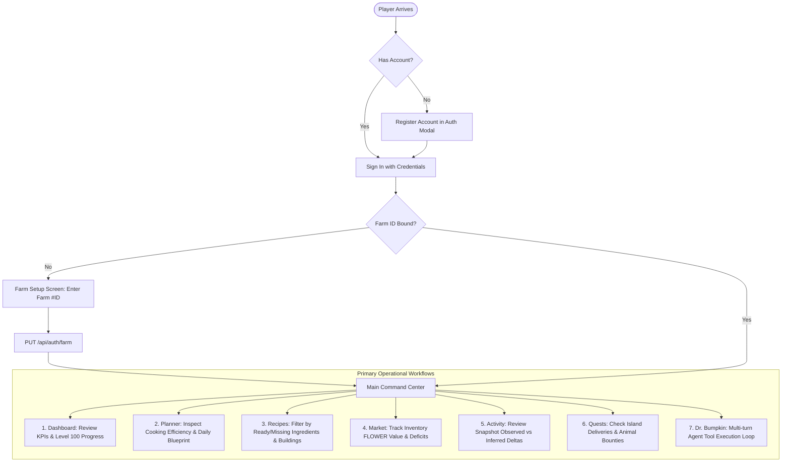

# 04. User Journeys & Operational Workflows 🧭

## 1. End-to-End User Journey Map



---

## 2. Detailed Operational Workflows

### 2.1 Onboarding & Farm NFT Association
1. **Account Registration**: The player signs up with a unique username, email, and password. A secure JWT is issued and stored in browser `localStorage`.
2. **Farm ID Discovery**: The player enters their Sunflower Land numeric Farm ID (e.g. `#29411`) in the setup modal.
3. **Binding Request**:
   ```javascript
   // client/src/App.jsx - Binding farm ID
   const saveFarmId = async () => {
     try {
       const res = await api.updateFarmId(farmInput);
       if (res.token) localStorage.setItem('token', res.token);
       setUser((prev) => ({ ...prev, farm_id: farmInput }));
       load(); // Trigger parallel dataset refresh
     } catch (err) {
       setError(err.message);
     }
   };
   ```
4. **Workspace Unlock**: The application transitions from setup to the Obsidian + Notion dual-pane workspace.

---

### 2.2 Operational Dashboard Workflow
Upon loading, the client fires a parallel batch of queries to populate the command center:

```javascript
// client/src/App.jsx - Parallel Workspace Bootstrapping
const load = async () => {
  setRefreshing(true);
  try {
    const [f, p, m, rec] = await Promise.all([
      api.farm().catch(() => null),
      api.planner().catch(() => null),
      api.market().catch(() => null),
      api.recipes().catch(() => null),
    ]);
    if (f) setFarm(f);
    if (p) setPlan(p);
    if (m) setMarket(m);
    if (rec) setRecipes(rec);
  } finally {
    setRefreshing(false);
  }
};
```

- **Road to Level 100 Progress Bar**:
  $$\text{Progress \%} = \min\left(\frac{\text{Bumpkin XP}}{24,083,905} \times 100, 100\right)$$
- **Active Cooking Pipeline**: Quick-look cards for each production building displaying current status, oil level, busy timers, and top recommended recipes.

---

### 2.3 Cooking & XP Planner Workflow
- **Optimization Matrix Table**: A database table comparing building recipes, sorted by:
  - `XP / Batch`: Raw XP produced per cook batch.
  - `FLOWER Cost`: Total out-of-pocket FLOWER needed given current inventory.
  - `XP / FLOWER`: The economic efficiency ratio.
  - `XP / Hour`: The throughput ratio factoring cook duration and intermediate steps.
  - `Batches to L100`: Exact batches needed to bridge the remaining XP gap to Level 100.
  - `Total Milestone FLOWER`: Total FLOWER required for the entire Level 100 journey.
- **Today's Action Blueprint**:
  - Direct harvest checklist.
  - Market purchases required (missing tradable ingredients).
  - High-priority deficit callouts for untradable items (Milk, Eggs, Honey).

---

### 2.4 Recipe Catalogue Exploration
- **Building Tabs**: Switch effortlessly between Fire Pit, Kitchen, Bakery, Deli, and Smoothie Shack.
- **State Filtering**:
  - `All`: Full catalog for the building.
  - `✓ Ready`: Recipes where $100\%$ of ingredients exist in inventory.
  - `Missing`: Recipes missing one or more ingredients, with shortfall breakdown badges (`Need X, Have Y, Short Z`).
- **Skill Boost Indicators**: Badges indicating active boosts (e.g. *VIP Access +10%*, *Munching Mastery +5%*, *Double Nom 2×*).

---

### 2.5 Market Valuation & Inventory Arbitrage
- **Total Inventory Valuation**: Calculates the aggregate liquid worth of all stored items in FLOWER.
- **Filter Controls**: "Show All Items" vs "✓ In Stock Only" toggles.
- **Sorting**: Sort inventory cards by total value (descending), unit price, or alphabetically.
- **Deficit Calculation**: Visual indicators showing whether an ingredient can be bought from P2P orderbooks or must be produced on-farm.

---

### 2.6 Snapshot Activity & Delta Analysis
- **Observation Window**: Automatically compares the two most recent farm state snapshots.
- **Observed Counters**: Direct on-chain counter comparisons (e.g. +50 Sunflowers harvested, +12 Trees chopped).
- **Inferred Movements**: Deduces XP gained, tokens earned or spent, and items consumed between snapshots:

```typescript
// server/services/farm/ActivityService.ts - Activity Diffs
export class ActivityService {
  diff(prevInput: CanonicalFarmState, currInput: CanonicalFarmState): ActivityDiff {
    const prev = prevInput?.data_json ?? prevInput;
    const curr = currInput?.data_json ?? currInput;

    const observed: Record<string, number> = {};
    for (const [k, v] of Object.entries(curr.farmActivity ?? {})) {
      const d = v - (prev.farmActivity?.[k] ?? 0);
      if (d !== 0) observed[k] = d;
    }

    const inferred: Record<string, number> = {};
    const keys = new Set([...Object.keys(prev.inventory ?? {}), ...Object.keys(curr.inventory ?? {})]);
    for (const k of keys) {
      const d = (curr.inventory?.[k] ?? 0) - (prev.inventory?.[k] ?? 0);
      if (Math.abs(d) > 1e-9) inferred[k] = +d.toFixed(4);
    }

    return {
      observed,
      inferred,
      xpDelta: (curr.bumpkin?.xp ?? 0) - (prev.bumpkin?.xp ?? 0),
      from: prev.fetchedAt,
      to: curr.fetchedAt,
    };
  }
}
```

---

### 2.7 Interactive AI Consultation ("Dr. Bumpkin")
- **Access Points**: Floating launcher button at bottom-right of screen, shortcut `Ctrl+J` / `⌘J`, or left ribbon icon.
- **Quick-Prompt Chips**:
  - *"What should I cook today?"*
  - *"What is my current bottleneck?"*
  - *"How much FLOWER to Level 100?"*
  - *"How do I unlock Volcano Island?"*
- **Agentic Tool Execution Flow**:
  1. User prompt sent to `POST /api/chat/message`.
  2. `Orchestrator.ts` parses intent and invokes tools (e.g., `get_farm_state`, `get_planner`, `compute_recipe_cost`).
  3. Building ownership verification ensures recipes are flagged if the player does not own the building.
  4. Deduplication cache ensures fast responses, with `force: true` available when fresh live data is required.
  5. Groq LLM returns formatted Markdown with bold metrics and actionable bullet points.

---

## 3. Responsive Mobile Workflow (< 768px)

On mobile and small viewport screens, the UX adapts automatically:
- **Discord-Style Slim Dock**: The expandable `w-60` Notion drawer is disabled to preserve full canvas width. A permanent `w-12` vertical icon dock exposes all 7 operational tabs.
- **Mobile Account Popover**: An avatar at the bottom of the ribbon provides 1-tap access to Farm ID, external link to `sunflower-land.com/play/?farmId=...`, and Sign Out.
- **Bottom Overlap Buffer**: A `pb-28` canvas scroll padding guarantees that cards and action buttons never get obscured by the floating Dr. Bumpkin launcher.
- **Single-Line Controls**: Market headers stack responsively, and buttons prevent multi-line text wrapping (`whitespace-nowrap flex-1 md:flex-none`).

