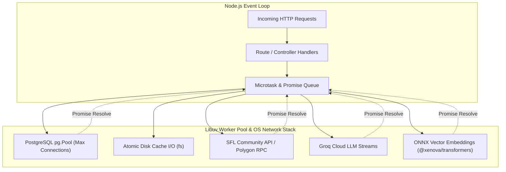

# 06. Concurrency, Asynchronous Execution & Process Flow 🧵

## 1. Concurrency Architecture

Sunflower AI is built on the **Node.js asynchronous, non-blocking, event-driven architecture**. 

While JavaScript execution is single-threaded, the application coordinates multiple concurrent background I/O operations, connection pooling, on-demand AI vector embeddings, multi-turn LLM tool execution, and in-flight API deduplication mechanisms.



---

## 2. Asynchronous Patterns & Concurrency Control

### 2.1 In-Flight Request Deduplication (`SunflowerClient.ts`)
When multiple concurrent requests query the same Farm ID (e.g. initial page load or rapid user tab switching), naive fetching triggers redundant network calls leading to HTTP 429 (Too Many Requests).

Sunflower AI implements an in-flight Promise map deduplication pattern:

```typescript
// server/services/farm/SunflowerClient.ts - In-Flight Deduplication
export class SunflowerClient {
  private memCache: Record<string, CacheEntry> = {};
  private pending = new Map<string, Promise<unknown>>();

  private async cached<T>(key: string, ttl: number, fn: () => Promise<T>): Promise<T & { stale: boolean; cached: boolean }> {
    const hit = this.memCache[key];
    if (hit && Date.now() - hit.at < ttl) {
      return { ...(hit.data as T), stale: false, cached: true };
    }

    // Deduplication: If a fetch is already in-flight for this key, return the active Promise
    if (this.pending.has(key)) {
      return this.pending.get(key) as Promise<T & { stale: boolean; cached: boolean }>;
    }

    const promise = fn()
      .then((data) => {
        this.memCache[key] = { at: Date.now(), data };
        this.saveDiskCache();
        return { ...data, stale: false, cached: false };
      })
      .catch((e) => {
        if (hit) {
          // Fallback to stale data on network or rate limit failure
          console.warn(`⚠️ API error for "${key}", serving stale cache: ${(e as Error).message}`);
          return { ...(hit.data as T), stale: true, error: String(e), cached: true };
        }
        throw e;
      })
      .finally(() => {
        // Clean up pending map once settled
        this.pending.delete(key);
      });

    this.pending.set(key, promise);
    return promise as Promise<T & { stale: boolean; cached: boolean }>;
  }
}
```

---

### 2.2 Client-Side Parallelism (`Promise.all`)
Upon workspace mount, the React frontend issues requests in parallel rather than sequentially, reducing loading latency to the speed of the slowest single response:

```javascript
// client/src/App.jsx - Parallel Workspace Bootstrapping
const load = async () => {
  setRefreshing(true);
  try {
    const [f, p, m, rec] = await Promise.all([
      api.farm().catch(() => null),
      api.planner().catch(() => null),
      api.market().catch(() => null),
      api.recipes().catch(() => null),
    ]);
    if (f) setFarm(f);
    if (p) setPlan(p);
    if (m) setMarket(m);
    if (rec) setRecipes(rec);
  } finally {
    setRefreshing(false);
  }
};
```

---

### 2.3 Agentic Tool Execution Loop (`Orchestrator.ts`)
The conversational AI engine coordinates an iterative multi-turn tool execution loop with Groq Cloud LLMs:

```typescript
// server/services/ai/Orchestrator.ts - Iterative Agent Loop
export class Orchestrator {
  async runAgent(message: string, sessionId: string, userId: number, farmId: string, history: any[] | null = null) {
    const steps: Array<{ tool: string; ok: boolean; cached?: boolean }> = [];
    const seen = new Map<string, any>(); // In-turn tool call dedup cache
    const context: ToolContext = { sessionId, userId, farmId, userGoal: message };

    const MAX_ROUNDS = 8;
    for (let i = 0; i < MAX_ROUNDS; i++) {
      const j = await this.groq(messages);
      const m = j.choices?.[0]?.message ?? {};

      // If the model finished without tool calls, we have our final answer
      if (!m.tool_calls?.length) {
        const answer = this.textOf(m);
        if (answer) return { answer, steps };
      }

      // Execute requested tools
      for (const tc of m.tool_calls) {
        const name = tc.function?.name;
        const parsedArgs = this.safeParseArgs(tc.function?.arguments);
        const forceRefresh = !!parsedArgs?.force;
        if (forceRefresh) delete parsedArgs.force;

        const key = `${name}:${JSON.stringify(parsedArgs)}`;
        let result: any;

        // Dedup cache check: skip duplicate tool executions unless force: true is passed
        if (!forceRefresh && seen.has(key)) {
          result = { note: 'Duplicate call — using cached data.', ...seen.get(key) };
          steps.push({ tool: name, ok: true, cached: true });
        } else {
          const tool = this.tools[name];
          result = await tool.exec(parsedArgs, context);
          steps.push({ tool: name, ok: !result?.error });
          seen.set(key, result);
        }

        messages.push({ role: 'tool', tool_call_id: tc.id, content: JSON.stringify(result) });
      }
    }
    // Fallback answer generation if round limit reached...
  }
}
```

---

### 2.4 Local Vector Embedding Pipeline (`ChatStoreService.ts`)
To power pgvector semantic retrieval without remote SaaS embedding fees or network latency, Sunflower AI embeds conversation turns locally via `@xenova/transformers`:
- Model: `Xenova/all-MiniLM-L6-v2` (384 dimensions).
- Uses ONNX runtime compiled for WebAssembly / Node.js.
- Executes asynchronously without blocking the Express event loop.

```typescript
// server/services/chat/ChatStoreService.ts - Local ONNX Embeddings
export class ChatStoreService {
  private embedder: any = null;

  private async getEmbedder() {
    if (!this.embedder) {
      const { pipeline } = await import('@xenova/transformers');
      this.embedder = await pipeline('feature-extraction', 'Xenova/all-MiniLM-L6-v2');
    }
    return this.embedder;
  }

  async embed(text: string): Promise<number[]> {
    const pipe = await this.getEmbedder();
    const out = await pipe(text, { pooling: 'mean', normalize: true });
    return Array.from(out.data);
  }
}
```

---

## 3. Database Connection Resilience & Startup Retry

In containerized environments (Docker Compose), PostgreSQL may take several seconds to initialize after the Express backend starts.

The server implements an exponential backoff connection retry loop:

```mermaid
flowchart TD
    Start([Server Boot]) --> Attempt[Attempt 1: connectWithRetry()]
    Attempt -- Success --> Ready[✅ Database Ready: Listen on Port]
    Attempt -- Failure --> CheckMax{Attempt == Max?}
    CheckMax -- Yes --> Fail[Exit process / Alert]
    CheckMax -- No --> Wait[Wait: min(baseDelay * 2^(attempt-1), 32s)]
    Wait --> NextAttempt[Attempt N+1]
    NextAttempt --> Ready
    NextAttempt -- Failure --> CheckMax
```

- Max attempts: `10`
- Initial delay: `2,000ms`
- Maximum capped delay: `32,000ms`

---

## 4. Atomic Disk Persistence

To ensure cache files (`api-cache.json`) are never corrupted during concurrent writes or sudden process terminations:
- Cache writes are serialized synchronously via `fs.writeFileSync`.
- Parent directories are verified recursively (`mkdirSync(CACHE_DIR, { recursive: true })`).
- Startup reads default gracefully to an empty in-memory state `{}` on any read or parse error.

