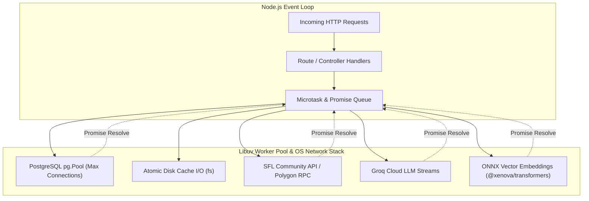

# 06. Concurrency, Asynchronous Execution & Process Flow 🧵

## 1. Concurrency Architecture

Sunflower AI is built on the **Node.js asynchronous non-blocking event-driven architecture**. 

While the JavaScript execution thread is single-threaded, the application coordinates multiple concurrent background I/O operations, asynchronous connection pools, on-demand AI vector embeddings, and in-flight API deduplication mechanisms.



---

## 2. Asynchronous Patterns & Concurrency Control

### 2.1 In-Flight Request Deduplication (`server/services/sunflower.js`)
When multiple concurrent requests query the same Farm ID (e.g. rapid page navigation or simultaneous client requests), naive fetching would trigger redundant external network calls and lead to HTTP 429 (Too Many Requests).

Sunflower AI implements an in-flight Promise map deduplication pattern:

```javascript
// server/services/sunflower.js
const pending = new Map();

async function cached(key, ttl, fn) {
  const hit = memCache[key];
  if (hit && Date.now() - hit.at < ttl) {
    return { ...hit.data, stale: false, cached: true };
  }

  // Deduplication: If a fetch is already in-flight for this key, reuse the existing Promise
  if (pending.has(key)) {
    return pending.get(key);
  }

  const promise = fn()
    .then((data) => {
      memCache[key] = { at: Date.now(), data };
      saveDiskCache();
      return { ...data, stale: false, cached: false };
    })
    .catch((e) => {
      if (hit) {
        // Fallback to stale data on network or rate limit failure
        return { ...hit.data, stale: true, error: String(e) };
      }
      throw e;
    })
    .finally(() => {
      // Remove from pending map once settled
      pending.delete(key);
    });

  pending.set(key, promise);
  return promise;
}
```

### 2.2 Client-Side Parallelism (`Promise.all`)
Upon loading the workspace, the React frontend loads all core domains concurrently rather than sequentially:

```javascript
// client/src/App.jsx
const load = async () => {
  setRefreshing(true);
  try {
    const [f, p, m, rec] = await Promise.all([
      api.farm().catch(() => null),
      api.planner().catch(() => null),
      api.market().catch(() => null),
      api.recipes().catch(() => null),
    ]);
    if (f) setFarm(f);
    if (p) setPlan(p);
    if (m) setMarket(m);
    if (rec) setRecipesData(rec);
  } finally {
    setRefreshing(false);
  }
};
```

This cuts initial dashboard loading time down to the latency of the single slowest endpoint.

### 2.3 Local AI Embedding Execution
To power the pgvector semantic search without relying on expensive remote embedding APIs, Sunflower AI uses `@xenova/transformers`:
- Model: `Xenova/all-MiniLM-L6-v2` (384 dimensions).
- Uses ONNX runtime compiled for WebAssembly / Node.js.
- Computations execute asynchronously via worker tasks, avoiding blocking the main HTTP event loop during prompt generation.

```javascript
// server/services/orchestrator.js
let embedder = null;
async function getEmbedder() {
  if (!embedder) {
    const { pipeline } = await import('@xenova/transformers');
    embedder = await pipeline('feature-extraction', 'Xenova/all-MiniLM-L6-v2');
  }
  return embedder;
}
```

---

## 3. Database Connection Resilience & Startup Retry

In containerized deployments (Docker Compose), the PostgreSQL database container may take several seconds to initialize after the Express backend container starts.

To prevent container crash loops, the server features an asynchronous retry loop with **exponential backoff**:

```mermaid
flowchart TD
    Start([Server Boot]) --> Attempt[Attempt 1: init()]
    Attempt -- Success --> Ready[✅ Database Ready: Listen on Port]
    Attempt -- Failure --> CheckMax{Attempt == Max?}
    CheckMax -- Yes --> LimitedMode[⚠️ Start in Limited Mode: DB Features Disabled]
    CheckMax -- No --> Wait[Wait: min(baseDelay * 2^(attempt-1), 32s)]
    Wait --> NextAttempt[Attempt N+1]
    NextAttempt --> Ready
    NextAttempt -- Failure --> CheckMax
```

- Max attempts: `10`
- Initial delay: `2,000ms`
- Maximum capped delay: `32,000ms`
- If PostgreSQL fails completely, the server boots in **Limited Mode** to still serve market data and health checks rather than crashing.

---

## 4. Atomic Disk Persistence

To ensure cache files (`api-cache.json`) are never corrupted during concurrent reads or sudden process terminations:
- Cache updates are serialized synchronously via `fs.writeFileSync`.
- Cache writes are guarded by recursive directory verification (`mkdirSync(CACHE_DIR, { recursive: true })`).
- Startup reads use graceful try/catch blocks defaulting to an empty in-memory state `{}` on any read or parse error.
