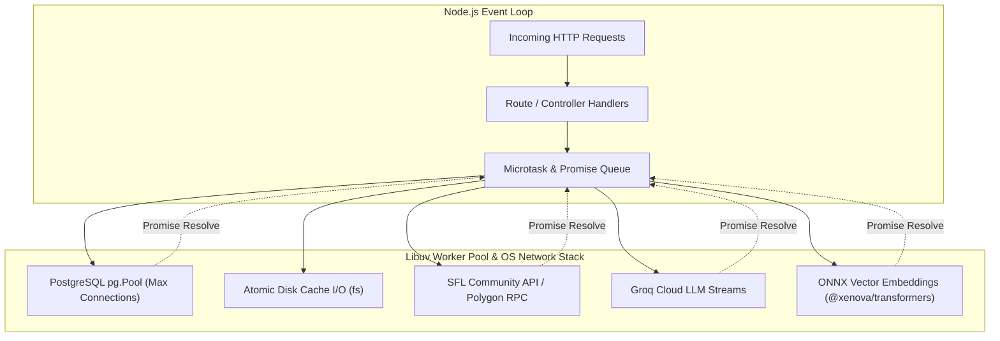

# 06. Concurrency, Asynchronous Execution & Process Flow 🧵

## 1. Concurrency Architecture

Sunflower AI is built on the **Node.js asynchronous, non-blocking, event-driven architecture**. 

While JavaScript execution is single-threaded, the application coordinates multiple concurrent background I/O operations, connection pooling, on-demand AI vector embeddings, multi-turn LLM tool execution, and in-flight API deduplication mechanisms.


```mermaid
graph TB
    subgraph EventLoop["Node.js Event Loop"]
        Incoming[Incoming HTTP Requests]
        Handler[Route / Controller Handlers]
        AsyncQ[Microtask & Promise Queue]
    end

    subgraph Libuv["Libuv Worker Pool & OS Network Stack"]
        DBPool["PostgreSQL pg.Pool (Max Connections)"]
        DiskCache["Atomic Disk Cache I/O (fs)"]
        ExtAPI["SFL Community API / Polygon RPC"]
        GroqAPI["Groq Cloud LLM Streams"]
        ONNX["ONNX Vector Embeddings (@xenova/transformers)"]
    end

    Incoming --> Handler
    Handler --> AsyncQ
    AsyncQ --> DBPool
    AsyncQ --> DiskCache
    AsyncQ --> ExtAPI
    AsyncQ --> GroqAPI
    AsyncQ --> ONNX

    DBPool -.->|Promise Resolve| AsyncQ
    ExtAPI -.->|Promise Resolve| AsyncQ
    GroqAPI -.->|Promise Resolve| AsyncQ
    ONNX -.->|Promise Resolve| AsyncQ
```

---

## 2. Asynchronous Patterns & Concurrency Control

### 2.1 In-Flight Request Deduplication (`SunflowerClient.ts`)
When multiple concurrent requests query the same Farm ID (e.g. initial page load or rapid user tab switching), naive fetching triggers redundant network calls leading to HTTP 429 (Too Many Requests).

Sunflower AI implements an in-flight Promise map deduplication pattern:

```typescript
// server/services/farm/SunflowerClient.ts - In-Flight Deduplication
export class SunflowerClient {
  private memCache: Record<string, CacheEntry> = {};
  private pending = new Map<string, Promise<unknown>>();

  private async cached<T>(key: string, ttl: number, fn: () => Promise<T>): Promise<T & { stale: boolean; cached: boolean }> {
    const hit = this.memCache[key];
    if (hit && Date.now() - hit.at < ttl) {
      return { ...(hit.data as T), stale: false, cached: true };
    }

    // Deduplication: If a fetch is already in-flight for this key, return the active Promise
    if (this.pending.has(key)) {
      return this.pending.get(key) as Promise<T & { stale: boolean; cached: boolean }>;
    }

    const promise = fn()
      .then((data) => {
        this.memCache[key] = { at: Date.now(), data };
        this.saveDiskCache();
        return { ...data, stale: false, cached: false };
      })
      .catch((e) => {
        if (hit) {
          // Fallback to stale data on network or rate limit failure
          console.warn(`⚠️ API error for "${key}", serving stale cache: ${(e as Error).message}`);
          return { ...(hit.data as T), stale: true, error: String(e), cached: true };
        }
        throw e;
      })
      .finally(() => {
        // Clean up pending map once settled
        this.pending.delete(key);
      });

    this.pending.set(key, promise);
    return promise as Promise<T & { stale: boolean; cached: boolean }>;
  }
}
```

---

### 2.2 Client-Side Parallelism (`Promise.all`)
Upon workspace mount, the React frontend issues requests in parallel rather than sequentially, reducing loading latency to the speed of the slowest single response:

```javascript
// client/src/App.jsx - Parallel Workspace Bootstrapping
const load = async () => {
  setRefreshing(true);
  try {
    const [f, p, m, rec] = await Promise.all([
      api.farm().catch(() => null),
      api.planner().catch(() => null),
      api.market().catch(() => null),
      api.recipes().catch(() => null),
    ]);
    if (f) setFarm(f);
    if (p) setPlan(p);
    if (m) setMarket(m);
    if (rec) setRecipes(rec);
  } finally {
    setRefreshing(false);
  }
};
```

---

### 2.3 Four-Stage AI Pipeline (`PipelineCoordinator.execute`)
`orchestrator.runAgent()` assembles pre-computed farm context, then delegates to the static `PipelineCoordinator.execute()`. Tools are **planned deterministically** (the LLM no longer emits `tool_calls`), executed against live state, validated, and only then explained with a single Groq call:

```typescript
// server/services/ai/pipeline/PipelineCoordinator.ts - Four-stage coordinator
export class PipelineCoordinator {
  private static readonly MAX_TOTAL_TOOL_CALLS = 8;

  public static async execute(
    message: string,
    context: PipelineContext,
    tools: ToolExecutorMap,
    priorHistory: Array<{ role: string; content: string }> = [],
    farmStateSupplier?: () => Promise<{ state: NormalizedFarmState; version?: number } | null>
  ): Promise<PipelineExecutionResult> {
    const steps: PipelineStep[] = [];
    let toolCallsCount = 0;

    // ── STAGE 1 (PLAN): deterministic tool selection — no LLM ────────────────
    const plan = await Planner.plan(message, context, priorHistory);

    // ── STAGE 2 (ACT): execute planned tools against live state (≤ 8 calls) ──
    const toolResults: Array<AIToolResult<unknown>> = [];
    let activeFarmState = context.farmState;
    for (const spec of plan.plannedTools) {
      if (toolCallsCount >= this.MAX_TOTAL_TOOL_CALLS) break;
      const tool = tools[spec.name];
      if (!tool) continue;
      toolCallsCount++;
      const res = await tool.exec(spec.args, context);
      toolResults.push(res);
      if (spec.name === 'get_farm_state' && res.success) {
        activeFarmState = (res.data as any)?.farm ?? activeFarmState;
      }
      steps.push({ stage: 'ORCHESTRATOR', tool: spec.name, ok: res.success });
    }

    // ── STAGE 3 (CHECK): verify vs NormalizedFarmState + precompute synthesis ─
    let validationReport = DeterministicValidator.validate(plan.criteria, toolResults, activeFarmState, context);

    // FIX: one targeted single-tool retry pass when the report is INVALID
    if (validationReport.status === 'INVALID' && validationReport.targetTool && toolCallsCount < this.MAX_TOTAL_TOOL_CALLS) {
      const retryRes = await tools[validationReport.targetTool.name]?.exec(validationReport.targetTool.args, context);
      if (retryRes) { toolResults.push(retryRes); validationReport = DeterministicValidator.validate(plan.criteria, toolResults, activeFarmState, context); }
    }

    // ── STAGE 4: Explainer makes the single Groq call from the synthesis ─────
    const answer = await Explainer.explain(message, toolResults, validationReport, context, priorHistory);
    return { success: true, answer, steps, /* warnings, provenance */ };
  }
}
```

> The in-turn `force: true` dedup bypass still exists at the tool layer in `Orchestrator.ts`; the coordinator itself bounds work with `MAX_TOTAL_TOOL_CALLS = 8` rather than a model-driven round loop.

---

### 2.4 Local Vector Embedding Pipeline (`ChatStoreService.ts`)
To power pgvector semantic retrieval without remote SaaS embedding fees or network latency, Sunflower AI embeds conversation turns locally via `@xenova/transformers`:
- Model: `Xenova/all-MiniLM-L6-v2` (384 dimensions).
- Uses ONNX runtime compiled for WebAssembly / Node.js.
- Executes asynchronously without blocking the Express event loop.

```typescript
// server/services/chat/ChatStoreService.ts - Local ONNX Embeddings
export class ChatStoreService {
  private embedder: any = null;

  private async getEmbedder() {
    if (!this.embedder) {
      const { pipeline } = await import('@xenova/transformers');
      this.embedder = await pipeline('feature-extraction', 'Xenova/all-MiniLM-L6-v2');
    }
    return this.embedder;
  }

  async embed(text: string): Promise<number[]> {
    const pipe = await this.getEmbedder();
    const out = await pipe(text, { pooling: 'mean', normalize: true });
    return Array.from(out.data);
  }
}
```

---

## 3. Database Connection Resilience & Startup Retry

In containerized environments (Docker Compose), PostgreSQL may take several seconds to initialize after the Express backend starts.

The server implements an exponential backoff connection retry loop:

```mermaid
flowchart TD
    Start([Server Boot]) --> Attempt[Attempt 1: connectWithRetry()]
    Attempt -- Success --> Ready[✅ Database Ready: Listen on Port]
    Attempt -- Failure --> CheckMax{Attempt == Max?}
    CheckMax -- Yes --> Fail[Exit process / Alert]
    CheckMax -- No --> Wait[Wait: min(baseDelay * 2^(attempt-1), 32s)]
    Wait --> NextAttempt[Attempt N+1]
    NextAttempt --> Ready
    NextAttempt -- Failure --> CheckMax
```

- Max attempts: `10`
- Initial delay: `2,000ms`
- Maximum capped delay: `32,000ms`

---

## 4. Atomic Disk Persistence

To ensure cache files (`api-cache.json`) are never corrupted during concurrent writes or sudden process terminations:
- Cache writes are serialized synchronously via `fs.writeFileSync`.
- Parent directories are verified recursively (`mkdirSync(CACHE_DIR, { recursive: true })`).
- Startup reads default gracefully to an empty in-memory state `{}` on any read or parse error.

