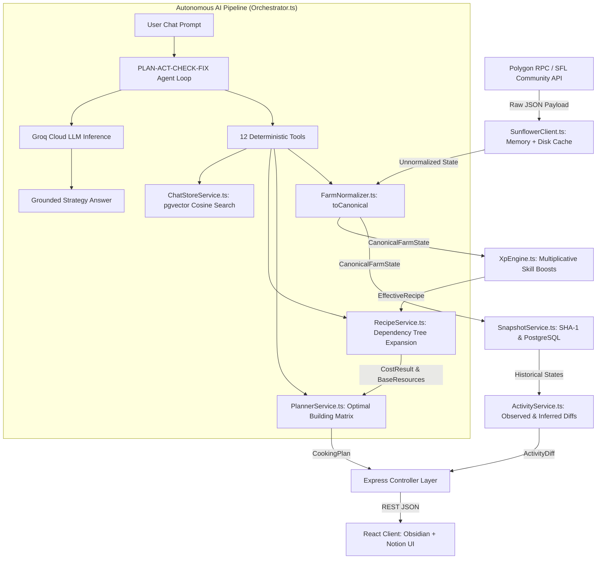

# 07. Data Lifecycle & Pipeline Flow 🔄

## 1. End-to-End Data Pipeline Overview

Sunflower AI transforms raw, polymorphic Web3 blockchain events and Community API payloads into strongly-typed domain entities, actionable economic intelligence, and vector-searchable operational memories.



---

## 2. Pipeline Stages in Detail

### 2.1 Ingestion & Resilience Tier (`SunflowerClient.ts`)
The client enforces a tiered caching strategy with in-flight Promise deduplication:
1. Check memory cache (`5 min` TTL for farm state, `10 min` for prices).
2. If absent, check in-flight `pending` Map to attach to an ongoing fetch.
3. Fetch from Community API with optional `x-api-key`.
4. Persist to memory and disk (`server/data/.cache/api-cache.json`).
5. On upstream failure or HTTP 429, fall back to stale cache with `stale: true`.

---

### 2.2 Normalization Tier (`FarmNormalizer.ts`)
Polymorphic raw JSON from SFL is transformed into a strict `CanonicalFarmState`:

```typescript
// server/services/farm/FarmNormalizer.ts - Canonical Normalization
export class FarmNormalizer {
  toCanonical(raw: unknown): CanonicalFarmState {
    const f = ((raw as any).farm ?? raw) as Record<string, any>;
    const bumpkin = f.bumpkin ?? {};
    const xp = Number(bumpkin.experience ?? 0);
    const buildings: Record<string, { busyUntil: number | null; oil: number }> = {};

    for (const [name, arr] of Object.entries(f.buildings ?? {})) {
      const b = Array.isArray(arr) ? arr[0] : arr;
      const crafting = (b?.crafting ?? []) as Array<{ readyAt?: number }>;
      const busyUntil = crafting.length ? Math.max(...crafting.map((c) => c.readyAt ?? 0)) : null;
      buildings[name] = { busyUntil, oil: Number(b?.oil ?? 0) };
    }

    return {
      bumpkin: { level: this.levelFromXp(xp), xp },
      currencies: {
        flower: String(f.balance ?? '0'),
        flowerApprox: Number(f.balance ?? 0),
        sfl: Number(f.balance ?? 0),
        coins: Number(f.coins ?? 0),
      },
      inventory: this.normalizeInventory(f.inventory),
      skills: bumpkin.skills ?? {},
      wearables: bumpkin.equipped ?? {},
      buffs: {
        vip: (f.vip?.expiresAt ?? 0) > Date.now(),
        active: Object.keys(f.buffs ?? {}),
      },
      buildings,
      farmActivity: f.farmActivity ?? {},
      deliveries: (f.delivery?.orders ?? []).map(this.normalizeDelivery),
      chores: this.normalizeChores(f.choreBoard?.chores),
      bounties: {
        requests: f.bounties?.requests ?? [],
        completed: f.bounties?.completed ?? [],
      },
      fetchedAt: Date.now(),
    };
  }
}
```

---

### 2.3 Mathematical XP Engine (`XpEngine.ts`)
Calculates effective XP yields, batch multipliers, and cook times:

$$\text{Effective XP} = \text{Base XP} \times \prod_{i=1}^n (1 + \text{Boost}_i)$$

```typescript
// server/services/cooking/XpEngine.ts - Boost Computation
export class XpEngine {
  effective(recipeName: string, recipe: RecipeDefinition, farm: Partial<CanonicalFarmState> = {}, customModifiers = {}) {
    let output = recipe.baseOutput ?? 1;
    let xpPerFood = recipe.baseXp ?? 0;
    let minutes = recipe.baseCookMinutes ?? 0;
    let ingredientMultiplier = 1;
    const applied: string[] = [];

    // VIP Multiplicative Boost (+10%)
    if (farm.buffs?.vip && !recipe.xpIncludesSkills) {
      xpPerFood *= 1.1;
      applied.push('VIP Access');
    }

    // Munching Mastery (+5% base rank, +2.5% per rank)
    if (farm.skills?.['Munching Mastery'] && !recipe.xpIncludesSkills) {
      const rank = Number(farm.skills['Munching Mastery']) || 1;
      xpPerFood *= 1 + 0.05 + (rank - 1) * 0.025;
      applied.push('Munching Mastery');
    }

    // Double Nom (2x output and 2x ingredients)
    if (farm.skills?.['Double Nom']) {
      output *= 2;
      ingredientMultiplier *= 2;
      applied.push('Double Nom');
    }

    return {
      recipe: recipeName,
      output,
      xpPerFood,
      minutes,
      batchXp: output * xpPerFood,
      ingredientMultiplier,
      applied,
    };
  }
}
```

---

### 2.4 Dependency Tree Expansion & Costing (`RecipeService.ts`)
Recursively expands nested recipes (e.g. Honey Cheddar requiring Cheese, which requires Milk) down to raw commodities and calculates market buy requirements:

```typescript
// server/services/cooking/RecipeService.ts - Dependency Expansion
export class RecipeService {
  expand(recipeName: string, recipes: Record<string, any>, depth = 0, multiplier = 1) {
    const recipe = recipes[recipeName];
    if (!recipe) return { base: {}, intermediateMinutes: 0 };
    const base: Record<string, number> = {};
    let intermediateMinutes = 0;

    for (const [ing, baseQty] of Object.entries(recipe.ingredients)) {
      const qty = (baseQty as number) * multiplier;
      if (recipes[ing]) {
        const sub = this.expand(ing, recipes, depth + 1, 1);
        const crafts = qty / (recipes[ing].baseOutput ?? 1);
        for (const [k, v] of Object.entries(sub.base)) base[k] = (base[k] ?? 0) + v * crafts;
        intermediateMinutes += crafts * (recipes[ing].baseCookMinutes ?? 0) + sub.intermediateMinutes * crafts;
      } else {
        base[ing] = (base[ing] ?? 0) + qty;
      }
    }
    return { base, intermediateMinutes };
  }

  cost(baseResources: Record<string, number>, prices: MarketPrice, items: Record<string, any>, inventory: Record<string, number>) {
    let flower = 0;
    let totalFlower = 0;
    const buy: Record<string, number> = {};
    const mustProduce: Record<string, number> = {};

    for (const [item, qty] of Object.entries(baseResources)) {
      const price = this.getItemPrice(item, prices);
      if (price != null) totalFlower += qty * price;

      const toBuy = Math.max(qty - (inventory[item] ?? 0), 0);
      if (toBuy === 0) continue;

      if (items[item]?.tradable === false || price == null) {
        mustProduce[item] = toBuy;
      } else {
        buy[item] = toBuy;
        flower += toBuy * price;
      }
    }
    return { flower, totalFlower, buy, mustProduce };
  }
}
```

---

### 2.5 Per-Building Optimization & Milestone Forecasting (`PlannerService.ts`)
Iterates over owned buildings and produces the optimal recipe plan and Level 100 milestone estimates:

$$\text{Batches to L100} = \left\lceil \frac{\max(24,083,905 - \text{Current XP}, 0)}{\text{Batch XP}} \right\rceil$$
$$\text{Total Milestone FLOWER} = \text{Batches to L100} \times \text{Flower Cost per Batch}$$

---

### 2.6 Historical Snapshot & Activity Differential Engine
- **Snapshot Hashing**: SHA-1 hash of `[xp, farmActivity, inventory]` prevents redundant rows.
- **Activity Delta**: Computes exact observed changes in counters and inferred resource deltas between the two latest snapshots.

---

### 2.7 AI Agentic Orchestration (`Orchestrator.ts`)
Operates a dynamic multi-round tool-calling loop:
1. Sanitizes conversational history ensuring alternating user/assistant turns.
2. Injects system instructions with strict game rules (FLOWER denomination, building checks, island progression).
3. Invokes deterministic tools to fetch fresh state.
4. If tool call JSON is malformed, prompts model to recover without crashing.
5. Returns grounded, bold markdown summaries.
ns.
