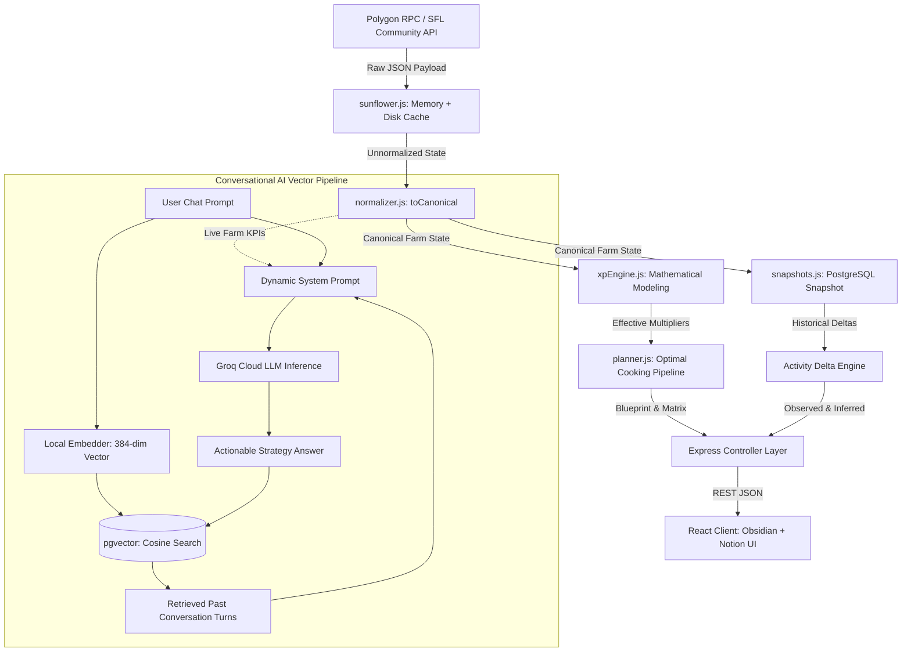

# 07. Data Lifecycle & Pipeline Flow 🔄

## 1. End-to-End Data Pipeline Overview

Sunflower AI transforms raw, unstructured Web3 blockchain events and Community API data into clean, actionable intelligence and vector-searchable operational memories.



---

## 2. Pipeline Stages

### 2.1 Ingestion & Normalization (`normalizer.js`)
Sunflower Land API payloads contain polymorphic data structures (e.g. inventory items mapped as string quantities, complex bumpkin equip clothing, nested building arrays).

`toCanonical(raw)` extracts and standardizes these into a predictable interface:
- **Bumpkin**: Level, current XP, milestone target XP (Level 100 = 5,000,000 XP), remaining XP needed.
- **Currencies**: Liquid Gold Coins and approximated FLOWER value.
- **Inventory**: Consolidated map of item names to numeric floating-point quantities.
- **Buildings**: Active cooking buildings (Fire Pit, Kitchen, Bakery, Deli, Smoothie Shack) and their current crafting states.
- **Skills**: Active skill masteries (e.g. *Munching Mastery*, *Drive-Through Deli*, *Double Nom*).
- **Quests & Deliveries**: NPC chore board entries and island deliveries with required items and coin/FLOWER rewards.

### 2.2 Mathematical XP Engine (`xpEngine.js`)
Calculates real effective values by applying active skill tree boosts and equipment bonuses:

$$\text{Effective XP} = \text{Base XP} \times \prod_{i=1}^n (1 + \text{Boost}_i)$$

```javascript
// Example: Cheese with Munching Mastery (+5%) and Drive-Through Deli (+15%)
// Base XP = 1.0
// Effective XP = 1.0 * 1.05 * 1.15 = 1.2075 XP per cheese
```

- **Batch Multiplier**: Evaluates whether *Double Nom* is active, doubling the recipe food output while scaling ingredient requirements accordingly.
- **Deficit & Market Cost**:
  $$\text{Quantity to Buy} = \max(\text{Required Ingredients} - \text{Owned Inventory}, 0)$$
  $$\text{FLOWER Cost} = \sum (\text{Quantity to Buy} \times \text{Market Unit Price})$$

### 2.3 Optimization & Blueprint Engine (`planner.js`)
For each production building, the planner sorts all candidate recipes by two primary dimensions:
1. **XP per FLOWER Cost**: Identifies the most budget-conscious path for capital-constrained players.
2. **XP per Cooking Hour**: Identifies the fastest path to Level 100 for time-constrained players.

It generates an actionable **Daily Blueprint** separating tradable ingredients to purchase from untradable ingredients that must be produced on the farm.

### 2.4 Snapshot Delta Engine (`snapshots.js`)
Snapshots are persisted in PostgreSQL under the `snapshots` table with a state hash:
- **Observed Deltas**: Exact differential counters of on-chain activity (e.g. `Sunflower Harvested: +120`, `Tree Chopped: +15`).
- **Inferred Deltas**: Mathematical difference in liquid XP, coin balances, and inventory quantities between the observation window $[t_1, t_2]$.

### 2.5 RAG Semantic Vector Memory (`orchestrator.js`)
1. **Query Vectorization**: When the player sends a message to Dr. Bumpkin, `@xenova/transformers` converts the prompt into a 384-dimensional vector.
2. **Cosine Distance Search**:
   ```sql
   SELECT content, role, 1 - (embedding <=> $1) AS similarity 
   FROM chat_messages 
   WHERE user_id = $2 AND session_id != $3 
   ORDER BY similarity DESC 
   LIMIT 4;
   ```
3. **Context Assembly**: The system prompt is assembled with:
   - Live Bumpkin level and XP deficit.
   - Recommended cooking candidates for each building.
   - Immediate bottleneck alerts (untradable resources missing).
   - Semantically relevant past conversation excerpts retrieved from `pgvector`.
4. **LLM Generation**: The prompt is submitted to Groq Cloud LLM, returning rapid, grounded tactical recommendations.
