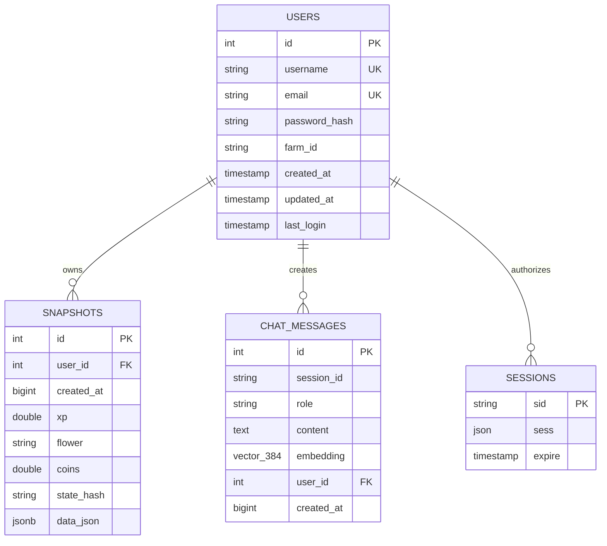

# 08. Data Models & Entity Schema Mapping 🗺️

## 1. Entity-Relationship (ER) Diagram



---

## 2. Database Table Schemas

### 2.1 `users`
Represents registered user accounts and workspace owners.

| Column | Type | Constraints | Description |
|---|---|---|---|
| `id` | `SERIAL` | `PRIMARY KEY` | Auto-incrementing unique user identifier |
| `username` | `VARCHAR(50)` | `UNIQUE NOT NULL` | Player handle for login |
| `email` | `VARCHAR(255)` | `UNIQUE NOT NULL` | Verified user email address |
| `password_hash` | `VARCHAR(255)` | `NOT NULL` | bcrypt hash (salt rounds = 10) |
| `farm_id` | `VARCHAR(100)` | `NULLABLE` | Sunflower Land on-chain Farm NFT ID |
| `created_at` | `TIMESTAMP` | `DEFAULT CURRENT_TIMESTAMP` | Account creation timestamp |
| `updated_at` | `TIMESTAMP` | `DEFAULT CURRENT_TIMESTAMP` | Last profile update timestamp |
| `last_login` | `TIMESTAMP` | `NULLABLE` | Timestamp of most recent successful login |

**Indexes**: `idx_users_username`, `idx_users_email`, `idx_users_farm_id`.

### 2.2 `snapshots`
Time-series log of farm state observations used for activity and progression analysis.

| Column | Type | Constraints | Description |
|---|---|---|---|
| `id` | `SERIAL` | `PRIMARY KEY` | Unique snapshot identifier |
| `user_id` | `INTEGER` | `REFERENCES users(id) ON DELETE CASCADE` | Associated workspace owner |
| `created_at` | `BIGINT` | `NOT NULL` | Epoch milliseconds when recorded |
| `xp` | `DOUBLE PRECISION` | `NULLABLE` | Bumpkin XP at time of snapshot |
| `flower` | `TEXT` | `NULLABLE` | FLOWER currency treasury balance |
| `coins` | `DOUBLE PRECISION` | `NULLABLE` | Liquid Gold Coins balance |
| `state_hash` | `TEXT` | `NULLABLE` | MD5 hash of inventory and stats to detect changes |
| `data_json` | `JSONB` | `NOT NULL` | Complete canonical farm state JSON document |

**Indexes**: `idx_snapshots_user_created (user_id, created_at DESC)`, `idx_snapshots_created`.

### 2.3 `chat_messages`
Stores assistant conversation logs and vector embeddings for semantic search.

| Column | Type | Constraints | Description |
|---|---|---|---|
| `id` | `SERIAL` | `PRIMARY KEY` | Unique message identifier |
| `session_id` | `TEXT` | `NOT NULL` | UUID grouping conversational threads |
| `role` | `TEXT` | `NOT NULL` | Message author: `'user'`, `'assistant'`, or `'history'` |
| `content` | `TEXT` | `NOT NULL` | Message body (supports GitHub Flavored Markdown) |
| `embedding` | `vector(384)` | `NULLABLE` | Normalized text vector embedding (`all-MiniLM-L6-v2`) |
| `user_id` | `INTEGER` | `REFERENCES users(id) ON DELETE CASCADE` | Associated workspace owner |
| `created_at` | `BIGINT` | `NOT NULL` | Epoch milliseconds when sent |

**Indexes**: `idx_chat_session`, `idx_chat_user_session (user_id, session_id, created_at)`.

---

## 3. In-Memory Domain Contracts (JSDoc / TypeScript)

### 3.1 Canonical Farm State (`normalizer.js`)
```typescript
interface CanonicalFarmState {
  bumpkin: {
    level: number;
    xp: number;
    equipped: Record<string, string>;
  };
  target: {
    level: number;       // Typically 100
    xp: number;          // Target XP anchor (5,000,000)
    remaining: number;   // max(target.xp - bumpkin.xp, 0)
  };
  currencies: {
    flowerApprox: number;
    coins: number;
  };
  inventory: Record<string, number>; // item name -> owned quantity
  buildings: Record<string, BuildingState[]>;
  skills: Record<string, number>;    // skill name -> rank/level
  chores: Record<string, Chore>;
  deliveries: DeliveryItem[];
  stale: boolean;
  cached: boolean;
}
```

### 3.2 Optimization Plan (`planner.js`)
```typescript
interface CookingPlan {
  buildings: BuildingPlanCandidate[];
  affordable: boolean;
  totalCost: number;       // In FLOWER
  totalBatchXp: number;
  farm: string[];          // Untradable crops to farm
  buy: Record<string, number>; // Tradable items to purchase
  notes: string[];
}

interface BuildingPlanCandidate {
  building: string;        // "Kitchen", "Bakery", etc.
  recipe: string;          // "Goblin's Treat"
  verified: boolean;
  batchXp: number;
  flowerCost: number;
  xpPerFlower: number;     // Efficiency ratio
  xpPerHour: number;       // Speed ratio
  totalMinutes: number;
}
```
