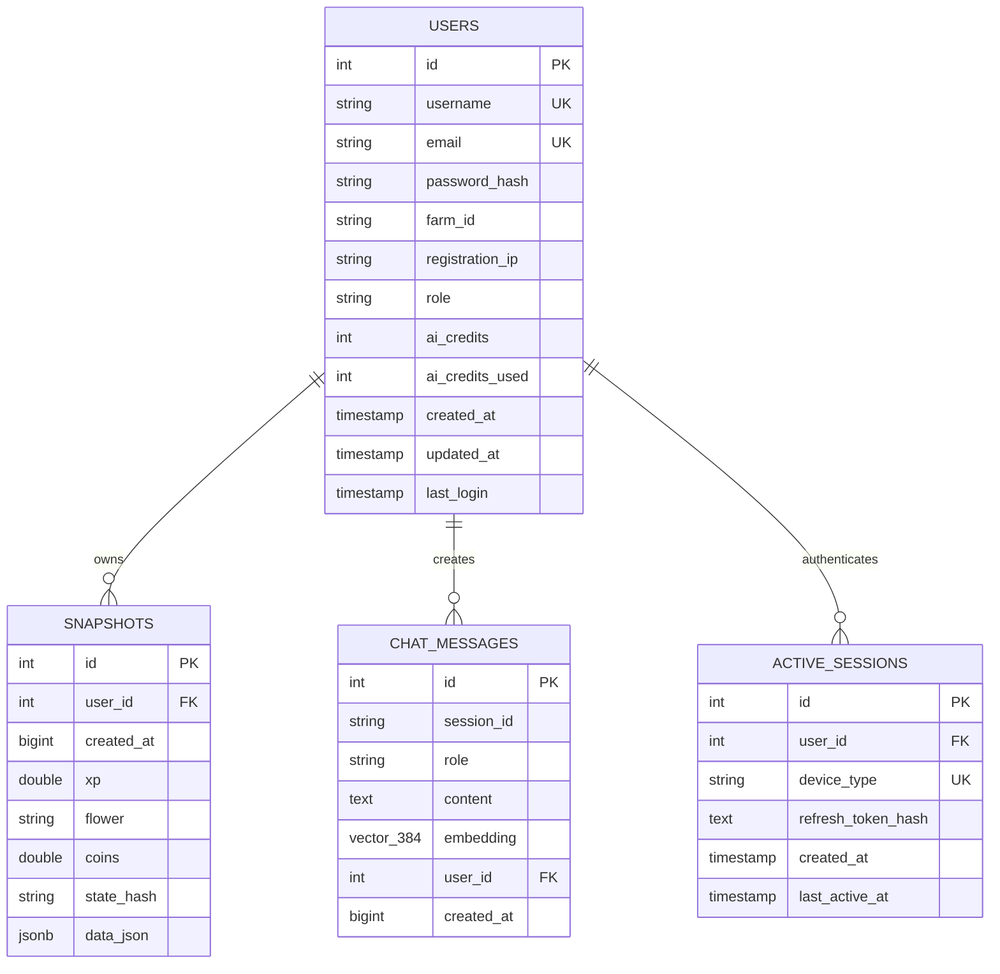

# 08. Data Models & Entity Schema Mapping 🗺️

## 1. Entity-Relationship (ER) Diagram



---

## 2. Database Table Schemas

### 2.1 `users`
Represents registered user accounts, workspace owners, IP attribution, and AI credit quotas.

| Column | Type | Constraints | Description |
|---|---|---|---|
| `id` | `SERIAL` | `PRIMARY KEY` | Auto-incrementing unique user identifier |
| `username` | `VARCHAR(50)` | `UNIQUE NOT NULL` | Player handle for login |
| `email` | `VARCHAR(255)` | `UNIQUE NOT NULL` | Verified user email address |
| `password_hash` | `VARCHAR(255)` | `NOT NULL` | bcrypt hash (salt rounds = 10) |
| `farm_id` | `VARCHAR(100)` | `NULLABLE` | Sunflower Land on-chain Farm NFT ID |
| `registration_ip`| `VARCHAR(45)` | `NULLABLE` | IP address at registration (1-Account-Per-IP gate) |
| `role` | `VARCHAR(20)` | `DEFAULT 'USER'` | Authorization tier: `'USER'` or `'DEVELOPER'` |
| `ai_credits` | `INTEGER` | `DEFAULT 50` | Available AI invocation credits |
| `ai_credits_used`| `INTEGER` | `DEFAULT 0` | Cumulative AI credits consumed |
| `created_at` | `TIMESTAMP` | `DEFAULT CURRENT_TIMESTAMP` | Account creation timestamp |
| `updated_at` | `TIMESTAMP` | `DEFAULT CURRENT_TIMESTAMP` | Last profile update timestamp |
| `last_login` | `TIMESTAMP` | `NULLABLE` | Timestamp of most recent successful login |

**Indexes**: `idx_users_username`, `idx_users_email`, `idx_users_farm_id`, `idx_users_registration_ip`.

### 2.2 `active_sessions`
Enforces the concurrent dual-device session limit (1 Desktop + 1 Mobile per user).

| Column | Type | Constraints | Description |
|---|---|---|---|
| `id` | `SERIAL` | `PRIMARY KEY` | Auto-incrementing session identifier |
| `user_id` | `INTEGER` | `REFERENCES users(id) ON DELETE CASCADE` | Associated workspace owner |
| `device_type` | `VARCHAR(10)` | `CHECK (device_type IN ('desktop', 'mobile'))` | Client device form factor |
| `refresh_token_hash` | `TEXT` | `NOT NULL` | SHA-256 hash of issued refresh token |
| `created_at` | `TIMESTAMP` | `DEFAULT now()` | Session initiation timestamp |
| `last_active_at` | `TIMESTAMP` | `DEFAULT now()` | Timestamp of most recent token refresh |

**Indexes**: `idx_one_session_per_device_type UNIQUE (user_id, device_type)`.

### 2.3 `snapshots`
Time-series log of farm state observations used for activity and progression analysis.

| Column | Type | Constraints | Description |
|---|---|---|---|
| `id` | `SERIAL` | `PRIMARY KEY` | Unique snapshot identifier |
| `user_id` | `INTEGER` | `REFERENCES users(id) ON DELETE CASCADE` | Associated workspace owner |
| `created_at` | `BIGINT` | `NOT NULL` | Epoch milliseconds when recorded |
| `xp` | `DOUBLE PRECISION` | `NULLABLE` | Bumpkin XP at time of snapshot |
| `flower` | `TEXT` | `NULLABLE` | FLOWER currency treasury balance (18-dp string) |
| `coins` | `DOUBLE PRECISION` | `NULLABLE` | Liquid Gold Coins balance |
| `state_hash` | `TEXT` | `NULLABLE` | SHA-1 hash of `[xp, farmActivity, inventory]` |
| `data_json` | `JSONB` | `NOT NULL` | Complete `CanonicalFarmState` JSON document |

**Indexes**: `idx_snapshots_user_created (user_id, created_at DESC)`, `idx_snapshots_created`.

### 2.4 `chat_messages`
Stores assistant conversation logs and vector embeddings for semantic search.

| Column | Type | Constraints | Description |
|---|---|---|---|
| `id` | `SERIAL` | `PRIMARY KEY` | Unique message identifier |
| `session_id` | `TEXT` | `NOT NULL` | UUID grouping conversational threads |
| `role` | `TEXT` | `NOT NULL` | Message author: `'user'`, `'assistant'`, or `'system'` |
| `content` | `TEXT` | `NOT NULL` | Message body (supports GitHub Flavored Markdown) |
| `embedding` | `vector(384)` | `NULLABLE` | Normalized text vector embedding (`all-MiniLM-L6-v2`) |
| `user_id` | `INTEGER` | `REFERENCES users(id) ON DELETE CASCADE` | Associated workspace owner |
| `created_at` | `BIGINT` | `NOT NULL` | Epoch milliseconds when sent |

**Indexes**: `idx_chat_session`, `idx_chat_user_session (user_id, session_id, created_at)`.

---

## 3. TypeScript Domain Interfaces (`server/types/index.ts`)

### 3.1 Canonical Farm State & Bumpkin State
```typescript
export interface BumpkinState {
  level: number;
  xp: number;
}

export interface CurrencyState {
  flower: string;      // 18-decimal string — never convert to float for money
  flowerApprox: number;
  sfl: number;
  coins: number;
}

export interface BuildingState {
  busyUntil: number | null;
  oil: number;
}

export interface CanonicalFarmState {
  bumpkin: BumpkinState;
  currencies: CurrencyState;
  inventory: Record<string, number>;
  skills: Record<string, number | boolean>;
  wearables: Record<string, string>;
  buffs: { vip: boolean; active: string[] };
  buildings: Record<string, BuildingState>;
  farmActivity: Record<string, number>;
  deliveries: DeliveryOrder[];
  chores: Record<string, unknown>;
  bounties: { requests: unknown[]; completed: unknown[] };
  fetchedAt: number;
  stale?: boolean;
  cached?: boolean;
}
```

### 3.2 Recipe & Economic Modeling
```typescript
export interface RecipeDefinition {
  building: string;
  baseXp: number;
  baseCookMinutes: number;
  baseOutput?: number;
  instantGems?: number;
  ingredients: Record<string, number>;
  verified?: boolean;
  xpIncludesSkills?: boolean;
}

export interface EffectiveRecipe {
  recipe: string;
  output: number;
  xpPerFood: number;
  minutes: number;
  batchXp: number;
  ingredientMultiplier: number;
  effectiveIngredients: Record<string, number>;
  applied: string[];
  boostBreakdown: Array<{ skill: string; rank: number; label: string }>;
}

export interface CostResult {
  flower: number;       // Out-of-pocket FLOWER to buy missing items
  totalFlower: number;  // Full FLOWER market valuation
  buy: Record<string, number>;
  mustProduce: Record<string, number>;
  unpriced: string[];
}
```

### 3.3 Cooking Plan & Milestone Forecasting
```typescript
export interface CookingPlanCandidate {
  recipe: string;
  verified: boolean;
  batchXp: number;
  flowerCost: number;
  flowerToBuy: number;
  buy: Record<string, number>;
  mustProduce: Record<string, number>;
  totalMinutes: number;
  xpPerFlower: number;
  xpPerHour: number;
  modifiers: string[];
  batchesToLevel100: number;
  totalMilestoneFlower: number;
}

export interface CookingPlanBuilding extends CookingPlanCandidate {
  building: string;
}

export interface CookingPlan {
  target: { level: number; xp: number; remaining: number };
  affordable: boolean;
  budget: { flower: string; coins: number };
  buildings: CookingPlanBuilding[];
  farm: string[];
  buy: string[];
  estimate?: {
    batches: number;
    flower: number;
    recipe: string;
    building: string;
    totalMilestoneFlower: number;
  };
  notes: string[];
}
```

---

## 4. Class Method Signatures

### 4.1 Controllers
- `AuthController`:
  - `register(req: Request, res: Response): Promise<Response>`
  - `login(req: Request, res: Response): Promise<Response>`
  - `me(req: Request, res: Response): Promise<Response>`
  - `updateFarmId(req: Request, res: Response): Promise<Response>`
  - `changePassword(req: Request, res: Response): Promise<Response>`
- `FarmController`:
  - `getFarmData(req: Request, res: Response): Promise<Response>`
  - `getMarket(req: Request, res: Response): Promise<Response>`
  - `getPlanner(req: Request, res: Response): Promise<Response>`
  - `getActivity(req: Request, res: Response): Promise<Response>`
  - `getXpProgression(req: Request, res: Response): Promise<Response>`
  - `getRecipes(req: Request, res: Response): Promise<Response>`
- `ChatController`:
  - `sendMessage(req: Request, res: Response): Promise<Response>`
  - `getSessions(req: Request, res: Response): Promise<Response>`
  - `getSession(req: Request, res: Response): Promise<Response>`
  - `deleteSession(req: Request, res: Response): Promise<Response>`

### 4.2 Services
- `SunflowerClient`:
  - `getFarm(farmId?: string | null): Promise<RawFarmResponse & { stale: boolean; cached: boolean }>`
  - `getPrices(): Promise<MarketResponse & { stale: boolean; cached: boolean }>`
- `FarmNormalizer`:
  - `toCanonical(raw: unknown): CanonicalFarmState`
  - `levelFromXp(xp: number): number`
- `XpEngine`:
  - `effective(recipeName: string, recipe: RecipeDefinition, farm?: Partial<CanonicalFarmState>, customModifiers?: Record<string, unknown>): EffectiveRecipe`
- `RecipeService`:
  - `expand(recipeName: string, recipes: Record<string, any>, depth?: number, multiplier?: number): ExpandResult`
  - `cost(baseResources: Record<string, number>, prices?: MarketPrice, items?: Record<string, any>, inventory?: Record<string, number>): CostResult`
  - `listRecipes(allRecipes: Record<string, any>, activeBuildings: string[], inventory?: Record<string, number>): Array<RecipeListItem>`
- `PlannerService`:
  - `plan(farm: CanonicalFarmState, prices: MarketPrice, recipes: Record<string, unknown>, items: Record<string, unknown>, modifiers: Record<string, unknown>): CookingPlan`
- `SnapshotService`:
  - `save(canonical: CanonicalFarmState, userId: number): Promise<{ saved: boolean; reason?: string }>`
  - `latest(userId: number, n?: number): Promise<CanonicalFarmState[]>`
- `ActivityService`:
  - `diff(prev: CanonicalFarmState, curr: CanonicalFarmState): ActivityDiff`
- `Orchestrator`:
  - `runAgent(message: string, sessionId: string, userId: number, farmId: string, history?: any[] | null): Promise<{ answer: string; steps: Array<{ tool: string; ok: boolean; cached?: boolean }> }>`

