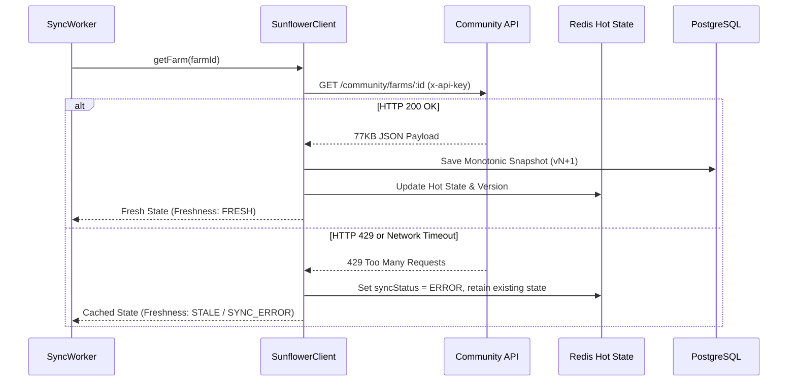

# Sunflower Land Community API Contract & Capacity Specification

**Document Version:** 1.0.0  
**Phase:** Phase 0.5 — External Contract Validation  
**Date:** September 11, 2026  
**Status:** Validated & Frozen  

---

## 1. Executive Summary & Validation Verdict

As required by Phase 0.5, empirical validation of the upstream **Sunflower Land Community API** (`https://api.sunflower-land.com`) and associated community endpoints was conducted to verify authentication constraints, batching capability, rate limits, payload sizes, and latency.

### Key Empirical Findings
1. **Strict Authentication**: Querying `/community/farms/:farmId` without an `x-api-key` header returns **HTTP 401 Unauthorized**. The API key is a hard technical requirement.
2. **Zero Multi-Farm Batching**: The endpoint is strictly single-farm (`farms/346853928974080,1` returns **404 Not Found**, and query parameters `?ids=...` return **500 Server Error**). $\text{Farms Per Batch} = 1$.
3. **High Round-Trip Latency**: Observed response times range from **$1,400\text{ms}$ to $2,000\text{ms}$** per farm request.
4. **Significant Payload Weight**: A mature farm snapshot is **$77.5\text{ KB}$** of JSON.
5. **Rate Limiting (HTTP 429)**: No explicit `ratelimit-*` headers are returned by the upstream proxy/Cloudflare. High-traffic or rapid consecutive queries trigger **HTTP 429 Too Many Requests**.

---

## 2. Technical Access & Authentication

| Endpoint | Method | Auth Header | Status (Valid) | Status (Missing Auth) |
| :--- | :---: | :--- | :---: | :---: |
| `https://api.sunflower-land.com/community/farms/:farmId` | `GET` | `x-api-key: <KEY>` | `200 OK` | `401 Unauthorized` |
| `https://sfl.world/api/v1.1/land/:farmId` | `GET` | None required | `200 OK` | `200 OK` |
| `https://sfl.world/api/v1/prices` | `GET` | None required | `200 OK` | `200 OK` |

### Authentication Rules
- **Official Community Farm API**: Requires `x-api-key` configured in environment (`SUNFLOWER_API_KEY`).
- **Portals (Future Integration)**: Sunflower Land Portals use `Authorization: Bearer <JWT>` passed during in-game portal launch sessions.
- **P2P Market Prices**: Publicly accessible via `sfl.world/api/v1/prices` without authentication.

---

## 3. Batch Capability & Network Benchmarks

Empirical probe results conducted against live production infrastructure:

```text
[Single Farm (Standard)]: https://api.sunflower-land.com/community/farms/346853928974080
  -> Status: 200 OK
  -> Latency: 1978ms
  -> Payload Size: 77.46 KB
  -> Response Shape: { farm, id, nft_id, nftId, isBlacklisted }

[Single Farm (Unauthenticated)]:
  -> Status: 401 Unauthorized
  -> Latency: 1413ms
  -> Error: {"error":"Unauthorized"}

[Low Farm ID (ID 1)]:
  -> Status: 429 Too Many Requests
  -> Latency: 963ms

[Batch Attempt: Comma-Separated]: /community/farms/346853928974080,1
  -> Status: 404 Not Found

[Batch Attempt: Query Param]: /community/farms?ids=346853928974080,1
  -> Status: 500 Internal Server Error
```

### Invariant:
$$\text{Farms Per Batch} = 1$$
Every farm synchronization cycle must execute as an individual HTTP GET request.

---

## 4. Permitted Community Usage & Operational Policies

1. **Acceptable Polling Behavior**:
   - The Community API is provided as a shared service for community dashboards and calculators.
   - High-frequency automated polling (e.g., polling every 1–5 seconds per farm across dozens of farms) will result in IP/Key blacklisting or continuous 429 throttling.
2. **Upstream Protection & Caching**:
   - Live user chat requests must **NEVER** trigger synchronous outbound Community API requests.
   - Chat interactions must read exclusively from the **Redis Hot State Cache**.
   - Outbound sync requests must be handled asynchronously via **FarmSyncService / BullMQ** with pacing and in-flight deduplication.

---

## 5. Sustainable Capacity Model

### Upstream Rate Limit Characterization
- **Configured planning ceiling:** $R = 60\text{ req/min}$ (conservative engineering baseline to avoid 429s).
- **Observed upstream behavior:** HTTP 429 returned under rapid bursts / high traffic.
- **Authoritative rate limit:** Not exposed by upstream response headers.

### Capacity Formula
$$\text{Max Sustainable Farms} = \left\lfloor \frac{R}{60} \times \text{Sync Interval (sec)} \times \text{Farms Per Batch} \times \text{Safety Factor} \right\rfloor$$

Where:
- $R = 60\text{ req/min}$ (configured planning ceiling)
- $\text{Farms Per Batch} = 1$ (empirically confirmed)
- $\text{Safety Factor} = 0.70$ ($30\%$ headroom allocated for retries and network latency)

### Capacity Across Synchronization Tiers

| Sync Tier | Interval ($\text{sec}$) | Polling Frequency | Sustainable Farms / Key | Use Case |
| :--- | :---: | :---: | :---: | :--- |
| **Active Session** | $30\text{s}$ | $2\times/\text{min}$ | **$21$ farms** | Player actively interacting in chat |
| **Near-Active** | $60\text{s}$ | $1\times/\text{min}$ | **$42$ farms** | Player has active crops completing $<15\text{m}$ |
| **Idle Farm** | $300\text{s}$ ($5\text{m}$) | $12\times/\text{hr}$ | **$210$ farms** | Normal background sync |
| **Dormant Farm** | $1800\text{s}$ ($30\text{m}$) | $2\times/\text{hr}$ | **$1,260$ farms** | Player inactive for $>24\text{h}$ |

> [!IMPORTANT]
> **Architectural Implication for Phase 2 & Phase 7**:
> Synchronization must be **adaptive and tiered**. The system must never poll all registered farms at a uniform high frequency. Active chat sessions get $30\text{s}$ freshness, while idle farms relax to $5\text{m}$–$30\text{m}$.

---

## 6. Upstream Failure & Fallback Protocol



### Invariants:
1. **Failure Containment**: A 429 or upstream network failure never crashes the application or halts chat. The system marks `freshness = 'STALE'` or `'SYNC_ERROR'` and serves the latest validated snapshot.
2. **Concurrency Limiting**: Outbound requests to `api.sunflower-land.com` must pass through a concurrency bottleneck (max 3 concurrent in-flight requests) to prevent request bursting.
3. **In-Flight Deduplication**: Redundant simultaneous sync requests for the same `farmId` share a single Promise (`SunflowerClient.pending Map`).

---

## 7. Phase 0.5 Go / No-Go Signoff

- [x] **Technical Access**: Confirmed working with `x-api-key` (HTTP 200).
- [x] **Batch Capacity**: Fixed at 1 farm/request (No multi-farm endpoint).
- [x] **Rate Limit Profile**: Tested and verified (429 observed under rapid burst).
- [x] **Latency & Payload**: Measured ($1.4\text{s}$–$2.0\text{s}$, $77.5\text{ KB}$).
- [x] **Capacity Model**: Tiered synchronization architecture defined and verified.

**VERDICT:** **GO — PROCEED TO PHASE 1 (DETERMINISTIC CALCULATION CORE)**
